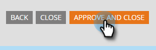

# Marketo Forms で CAPTCHA を有効にする {#enable-captcha-in-marketo-forms}

[!UICONTROL CAPTCHA]は、フォームごとに有効または無効にできます。

1. 目的のフォームを検索して選択します。

   

1. 「**[!UICONTROL ドラフトを編集]**」をクリックします（フォームが既に承認されている場合は、「[!UICONTROL ドラフトを作成]」をクリックします）。

   

1. 「**[!UICONTROL フォーム設定]**」、「**[!UICONTROL 設定]**」の順にクリックします。

   

1. 「**[!UICONTROL CAPTCHA]**」ドロップダウンを開き、「**[!UICONTROL 有効]**」を選択します。

   

1. 「**[!UICONTROL 終了]**」をクリックします。

   

1. 「**[!UICONTROL 承認して閉じる]**」をクリックします。

   

このリストに対する変更が Google から反映されるまで、数分かかる場合があります。

>[!NOTE]
>
>Google のプライバシーポリシーと利用規約へのリンクを含む標準化されたテキストが、CAPTCHA 対応フォームに追加されます。

>[!MORELIKETHIS]
>
>[reCAPTCHA v3 の設定](/help/marketo/product-docs/demand-generation/forms/using-captcha/setting-up-recaptcha-v3.md)
