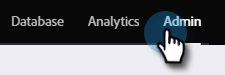

# [!UICONTROL reCAPTCHA v3] の設定 {#setting-up-recaptcha-v3}

ReCAPTCHA v3 は、テキスト、画像、ボタンといったユーザへのチャレンジを使用せずに、フォーム送信の疑わしさを評価するストレスフリーのエクスペリエンスです。[詳細情報](https://developers.google.com/search/blog/2018/10/introducing-recaptcha-v3-new-way-to){target="_blank"}。

## [!UICONTROL データセンター]と [!UICONTROL Munchkin ID] の取得 {#retrieve-your-data-center-and-munchkin-id}

以下の節、[!UICONTROL reCAPTCHA v3] の初期設定の手順 6 で、Marketo Engage サブスクリプションの[!UICONTROL データセンター]と [!UICONTROL Munchkin ID] が必要です。確認方法は、以下のとおりです。

1. Marketo で、「**[!UICONTROL 管理者]**」をクリックします。

   

1. 「**[!UICONTROL マイアカウント]**」をクリックします。

   

1. 下にスクロールして、[!UICONTROL サポート情報]を表示します。

   

## [!UICONTROL reCAPTCHA v3] の初期設定 {#initial-recaptcha-v3-setup}

次の手順は、Marketo の外部で実行します。

1. [https://www.google.com/recaptcha/about/](https://www.google.com/recaptcha/about/){target="_blank"} に移動し、v3 Admin Console をクリックします。

1. Google アカウントでログイン／新規登録します。

1. 「[!UICONTROL 作成]」ボタン（+ 記号）をクリックして、新しいキーを作成します。

1. Marketo Engage に使用するキーを識別するラベルを作成します。

1. **[!UICONTROL reCAPTCHA v3]** タイプを選択します。Marketo Engage は現在、reCAPTCHA v2 をサポートしていません。

1. Marketo Engage サブスクリプションが使用する各ドメインを追加します。ここで設定されていないドメインは、reCAPTCHA が有効なフォームでエラーを返します。必ず「datacenter」と「munchkinID」という単語を、[ご自身のサブスクリプションのデータ](#retrieve-your-data-center-and-munchkin-id)と置き換えてください。

   * app-datacenter.marketo.com
   * munchkinID.mktoweb.com
   * サブスクリプションで設定されたランディングページのドメインとエイリアス

   >[!NOTE]
   >
   >例えば、アカウントの[!UICONTROL データセンター]が「sjst」の場合、許可リストに登録するドメインは、`app-sjst.marketo.com` です。[!UICONTROL Munchkin ID] が 123-ABC-789 の場合、許可リストに登録するドメインは、`123-ABC-789.mktoweb.com` です。

1. このサービスに関するアラートを受け取る所有者と追加のメールアドレスを設定します。

1. reCAPTCHA サービス利用規約に同意します。

1. 「**[!UICONTROL 送信]**」をクリックします。

   >[!NOTE]
   >
   >サイトキーと秘密鍵を Marketo Engage 設定用に準備しておきます。

## Marketo Engage での CAPTCHA の設定 {#setting-up-captcha-in-marketo-engage}

>[!IMPORTANT]
>
>これらの手順に従い、[最初の Marketo フォームで CAPTCHA を有効](/help/marketo/product-docs/demand-generation/forms/using-captcha/enable-captcha-in-marketo-forms.md){target="_blank"}にした後は、reCAPTCHA 設定に誤りがあるとフォームが壊れる可能性があるので、すぐにフォームをテストしてください。

1. Marketo で、「**[!UICONTROL 管理者]**」をクリックします。

   

1. ツリーで「**[!UICONTROL CAPTCHA]**」を選択します。

   

1. [!UICONTROL CAPTCHA] の設定で、「**[!UICONTROL 編集]**」をクリックします。

   

1. [!UICONTROL CAPTCHA] ドロップダウンをクリックし、「[!UICONTROL reCAPTCHA v3]」を選択します。

   

1. **[!UICONTROL 秘密鍵]**&#x200B;と&#x200B;**[!UICONTROL サイトキー]**&#x200B;を挿入します。終了したら「**[!UICONTROL 保存]**」をクリックします。

   

>[!MORELIKETHIS]
>
>[Marketo Forms で CAPTCHA を有効にする](/help/marketo/product-docs/demand-generation/forms/using-captcha/enable-captcha-in-marketo-forms.md)
