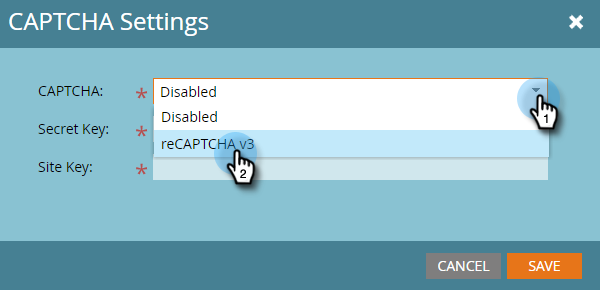

# reCAPTCHA v3 のセットアップ {#setting-up-recaptcha-v3}

ReCAPTCHA v3 は摩擦のないエクスペリエンスで、テキスト、画像、ボタンの課題を使用せずに、どれだけ疑わしいかに基づいてフォーム送信を評価します。 [詳細情報](https://developers.google.com/search/blog/2018/10/introducing-recaptcha-v3-new-way-to){target=&quot;_blank&quot;}。

## データセンターと Munchkin ID の取得 {#retrieve-your-data-center-and-munchkin-id}

以下の「初期 reCAPTCHA v3 セットアップ」セクションの手順 6 では、Marketo Engageサブスクリプションのデータセンターと Munchkin ID が必要です。 次に、それらを見つける方法を示します。

1. Marketo で、「**管理者**」をクリックします。

   

1. 「**マイアカウント**」をクリックします。

   

1. 下にスクロールして、サポート情報を表示します。

   

## reCAPTCHA v3 の初期設定 {#initial-recaptcha-v3-setup}

次の手順は、Marketoの外部で実行します。

1. に移動します。 [https://www.google.com/recaptcha/about/](https://www.google.com/recaptcha/about/){target=&quot;_blank&quot;} をクリックし、v3Admin Consoleをクリックします。

1. Googleアカウントでログイン/サインアップします。

1. 「作成」ボタン（+記号）をクリックして、新しいキーを作成します。

1. Marketo Engageに使用するキーを識別するラベルを作成します。

1. タイプを選択 **reCAPTCHA v3**. Marketo Engageは現在、reCAPTCHA v2 をサポートしていません。

1. Marketo Engage購読が使用する各ドメインを追加します。 ここで設定されていないドメインは、reCAPTCHA が有効なフォームでエラーを返します。 必ず「datacenter」と「munchkinID」という単語を [サブスクリプション内のデータ](#retrieve-your-data-center-and-munchkin-id).

   * app-datacenter.marketo.com
   * munchkinID.mktoweb.com
   * 配信登録で設定されたランディングページのドメインとエイリアス

   >[!NOTE]
   >
   >例えば、アカウントのデータセンターが「sjst」の場合、するドメインは次のようになりま許可リストす。 `app-sjst.marketo.com`. Munchkin ID が 123-ABC-789 の場合、ドメインは次のようになりま許可リストす。 `123-ABC-789.mktoweb.com`.

1. このサービスに関するアラートを受け取る所有者と追加の電子メールアドレスを設定します。

1. reCAPTCHA サービス利用条件に同意します。

1. 「**送信**」をクリックします。

   >[!NOTE]
   >
   >サイトキーと秘密鍵をMarketo Engage設定用に用意します。

## Marketo Engageでの CAPTCHA の設定 {#setting-up-captcha-in-marketo-engage}

1. Marketo で、「**管理者**」をクリックします。

   

1. 選択 **CAPTCHA** を設定します。

   

1. クリック **編集** をクリックします。

   

1. 「 CAPTCHA 」ドロップダウンをクリックし、「 reCAPTCHA v3 」を選択します。

   

1. 秘密鍵とサイトキーを挿入します。 終了したら「**保存**」をクリックします。

   
