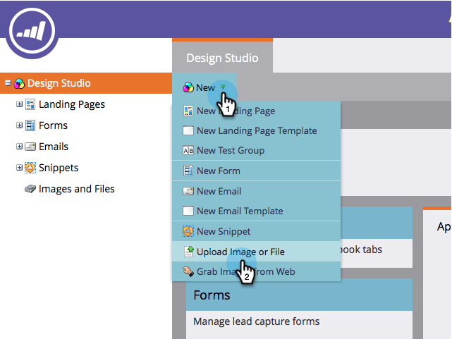
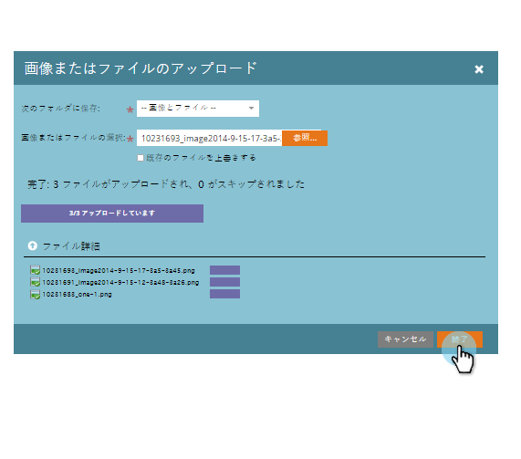

# マー追加ケティング担当者向けの画像とファイル {#add-images-and-files-to-marketo}

複数の画像とファイルを一度に追加するのは簡単です。

1. 「 **Design** Studio ****」に移動します。

   

1. 「 **新規**」で、「**アップロード画像** **または** ファイル ****」をクリックします。

   

1. 画像またはファイルを保存するフォルダを選択し、[ **参照**]をクリックします。

   

   >[!NOTE]
   >
   >ファイルあたりの最大サイズは100 MBです。

1. 複数の画像やファイルを追加するには、コンピューター上の正しいフォルダーを参照し、 **Ctrl/Command** キーを押しながら追加する各ファイルをクリックし、「 **開く**」をクリックします。

   

1. 「 **ファイルの詳細** 」を展開して、正しい画像が選択されていることを確認し、「 **アップロード**」をクリックします。

   

   >[!NOTE]
   >
   >**Reminder**
   >
   >
   >アップロード前にキューに登録されているファイルを削除するには、ファイル名の横のxをクリックします。

   >[!TIP]
   >
   >Marketorは、アップロード前にすべてのファイルをスキャンします。感染したファイルはスキップされます。

   アップロードが完了したら、「完了」をクリックします。
   

1. これで、画像をキャンペーンの電子メールやランディングページで使用できるようになります。

   

うまくいった！

>[!NOTE]
>
>Marketorは、すべてのファイルタイプをアップロードに使用できますが、メジャー画像タイプ（JPG、PNG、GIFなど）のみ は、電子メールエディターで機能します。

## ビデオの視聴 {#watch-a-video}

`<iframe width="630" height="470" src="//play.vidyard.com/ZWBeQ5oiXRKG2QAP5E7g6Q.html?v=3.1.1" frameborder="0" allowfullscreen></iframe>`

>[!MORELIKETHIS]
>
>* [フォルダを使用した画像とファイルの整理](organize-your-images-and-files-using-folders.md)

>

