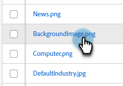
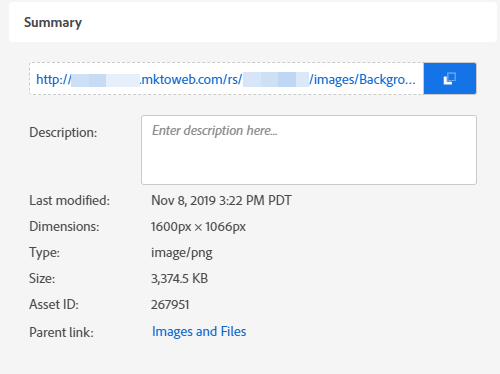

# アップロードされた画像またはファイルの URL を見つける {#find-the-url-of-an-uploaded-image-or-file}

アップロードした画像またはファイルのURLを見つけるには、次の手順に従います。

1. **[!UICONTROL Design Studio]** に移動します。

   

1. **[!UICONTROL 画像とファイル]**&#x200B;をクリックします。

   

1. 必要なアセットを選択します。

   

1. **[!UICONTROL URL]**&#x200B;が詳細ページに表示されます。

   

>[!MORELIKETHIS]
>
>[アップロードした画像またはファイルの置き換え](/help/marketo/product-docs/demand-generation/images-and-files/replace-an-uploaded-image-or-file.md){target="_blank"}
