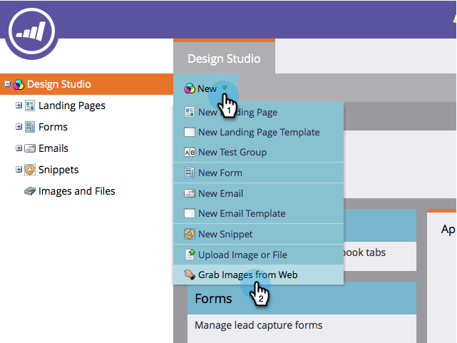

# Web ページからの画像の取得 {#grab-the-images-from-a-web-page}

Web ページから画像を追加するには、目的の画像を含むページのweb アドレス（URL）をコピーし、次の手順に従います。

1. 「**[!UICONTROL Design Studio]**」に移動します。

   

1. **[!UICONTROL 新規]**／**[!UICONTROL Web から画像を取得]**&#x200B;をクリックします。

   

1. **[!UICONTROL 画像とファイル]**&#x200B;フォルダーを選択して、「URL」テキストボックスに Web アドレス（URL）を貼り付けて、「**[!UICONTROL 次へ]**」をクリックします。

   

   >[!NOTE]
   >
   >この機能は、画像を直接指す URL では機能しません。 画像を含む Web ページの URL を使用します。

1. 追加する画像を選択し、「**[!UICONTROL インポート]**」をクリックします。

   

1. 画像がインポートされ、メールやランディングページで使用できるようになりました。

   

1. 使用可能な画像はすべて、**[!UICONTROL 画像とファイル]**&#x200B;で確認できます。

   

>[!MORELIKETHIS]
>
>* [画像とファイルを Marketo に追加](/help/marketo/product-docs/demand-generation/images-and-files/add-images-and-files-to-marketo.md)
>* [フォルダーを使用した画像とファイルの整理](/help/marketo/product-docs/demand-generation/images-and-files/organize-your-images-and-files-using-folders.md)
>* [アップロードされた画像またはファイルの URL を見つける](/help/marketo/product-docs/demand-generation/images-and-files/find-the-url-of-an-uploaded-image-or-file.md)
>* [Box からの画像とファイルのアップロード](/help/marketo/product-docs/demand-generation/images-and-files/upload-images-and-files-from-box.md)
