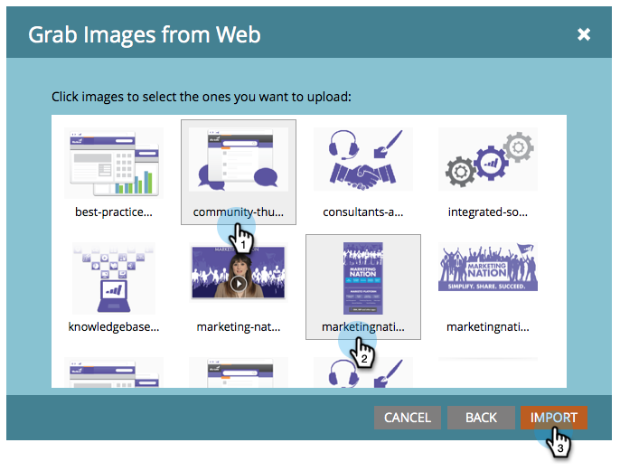

# Webページから画像を取得する {#grab-the-images-from-a-web-page}

Webページから画像を追加するには、目的の画像が含まれているページのWebアドレス(URL)をコピーし、次の簡単な手順に従います。

1. 「 **Design** Studio ****」に移動します。

   

1. 「 **New** and **Grab Images from Web**」をクリックします。

   

1. 「 **Images and Files** 」フォルダーを選択し、Webアドレス(URL)を「URL」テキストボックスに貼り付けて、「 **次へ」をクリックします。**

   

   >[!NOTE]
   >
   >この機能は、画像を直接指すURLには対応していません。 画像を含むWebページのURLを使用します。

1. 追加する画像を選択し、「 **読み込み」をクリックします。**

   

1. これで、画像が読み込まれ、電子メールやランディングページで使用できるようになります。

   

1. 使用可能なすべての画像は、「 **画像」と「ファイル**」で確認できます。

   

いい仕事だイメージマスター！

>[!MORELIKETHIS]
>
>* [マー追加ケティング担当者向けの画像とファイル](add-images-and-files-to-marketo.md)
>* [フォルダを使用した画像とファイルの整理](organize-your-images-and-files-using-folders.md)
>* [アップロードされた画像またはファイルのURLの検索](find-the-url-of-an-uploaded-image-or-file.md)
>* [Boxからの画像とファイルのアップロード](upload-images-and-files-from-box.md)

>

