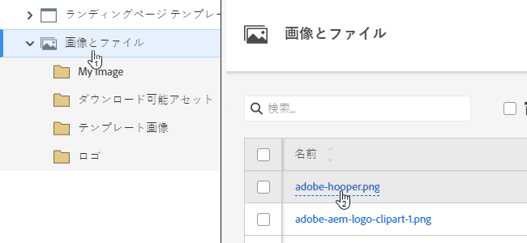
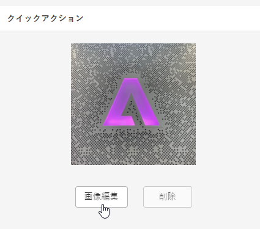
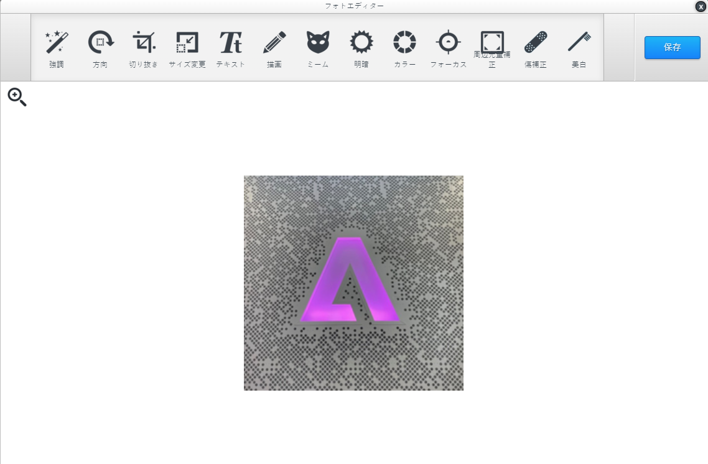

# 画像エディター {#image-editor}

画像エディターを使用すると、Marketo Engage で画像に対してすばやく簡単な変更を行うことができます。

1. **[!UICONTROL Design Studio]** に移動します。

   

1. 画像を探して選択します。

   

1. 「**[!UICONTROL 編集を編集]**」ボタンをクリックします。

   

1. 上部にあるツールバーの様々な機能から選択します。終了したら「**[!UICONTROL 保存]**」をクリックします。

   
