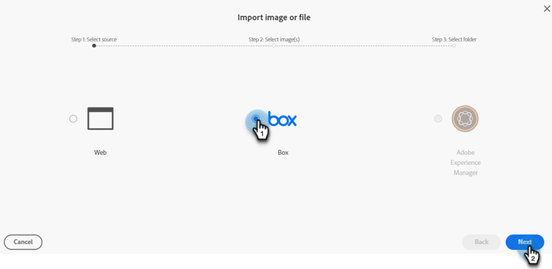

# 新しい画像追加ドキュメント {#new-add-images-doc}

新しいファイルや画像を画像およびファイルリポジトリに追加するための複数のオプションがあります。

## 画像またはファイルのアップロード {#upload-image-or-file}

1. **Design Studio** に移動します。

   

1. 「**[!UICONTROL 画像とファイル]**」を選択します

   

1. **[!UICONTROL 画像とファイルのアクション]**&#x200B;ドロップダウンをクリックし、「**[!UICONTROL 画像またはファイルをアップロード]**」を選択します。

   

1. 目的の画像／ファイルをドラッグ＆ドロップするか、コンピュータを参照して探します。

   

1. アセットを選択したら、「**アップロード**」をクリックします。

   

## 画像またはファイルのインポート {#import-image-or-file}

画像を読み込むには、3つのオプションがあります。 各製品について見ていきましょう。

### Webからインポート {#import-from-the-web}

テキスト

1. 上記](#upload-image-or-file)から手順1と2 [に従います。

1. **[!UICONTROL 画像とファイルのアクション]** ドロップダウンをクリックし、**[!UICONTROL 画像またはファイルの読み込み]**&#x200B;を選択します。

   

1. 「**[!UICONTROL Web]**」オプションを選択し、**[!UICONTROL 次へ]**&#x200B;をクリックします。

   

1. URLを入力するか、目的の画像に貼り付けて、**次へ**&#x200B;をクリックします。

PICC

1. 「空白」をクリックします。

PICC

### Boxからインポート {#import-from-box}

テキスト

1. 上記](#upload-image-or-file)から手順1と2 [に従います。

1. **[!UICONTROL 画像とファイルのアクション]** ドロップダウンをクリックし、**[!UICONTROL 画像またはファイルの読み込み]**&#x200B;を選択します。

   

1. **[!UICONTROL Box]** オプションを選択し、**[!UICONTROL Next]**&#x200B;をクリックします。

   

   >[!NOTE]
   >
   >以前に行ったことがない場合は、Box アカウントにログインしてアクセス権を付与するように求められます。

1. 目的のBox フォルダーを選択し、**[!UICONTROL 次へ]**&#x200B;をクリックします。

   

1. 目的の画像を選択し、**[!UICONTROL 次へ]**&#x200B;をクリックします。

   

1. 画像を保存するMarketo Engage フォルダーを選択します。 この例では、画像とファイル（デフォルト）のままにします。 「**読み込み**」をクリックします。

   

### Adobe Experience Manager からの読み込み {#import-from-adobe-experience-manager}

テキスト

1. 上記](#upload-image-or-file)から手順1と2 [に従います。

1. **[!UICONTROL 画像とファイルのアクション]** ドロップダウンをクリックし、**[!UICONTROL 画像またはファイルの読み込み]**&#x200B;を選択します。

   

1. 「**[!UICONTROL Adobe Experience Manager]**」オプションを選択し、「**[!UICONTROL 次へ]**」をクリックします。

   

   >[!NOTE]
   >
   >まだログインしていない場合は、AEM アカウントにログインするように求められます。

1. テキスト

PICC

1. テキスト

PICC

1. テキスト
