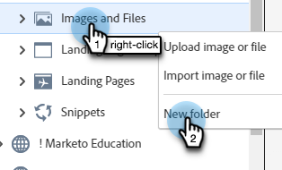

# フォルダーを使用した画像とファイルの整理 {#organize-your-images-and-files-using-folders}

フォルダーを作成すると、画像やファイルを移動したり、必要な画像のセットのみを表示したり、特定のフォルダーに直接アップロードしたりできます。

1. **[!UICONTROL Design Studio]** に移動します。

   

1. **[!UICONTROL 画像とファイル]** を右クリックし、「**[!UICONTROL 新規フォルダー]**」を選択します。

   

1. フォルダーに名前を付け、「**[!UICONTROL 作成]**」をクリックします。

   

1. **[!UICONTROL 画像とファイル]** に戻り、移動するアセットを選択します。 **[!UICONTROL 画像とファイルのアクション]** ドロップダウンをクリックし、「**[!UICONTROL 移動]**」を選択します。

   

1. 目的のフォルダーを選択します。

   

1. **Move** をクリックします。

   

>[!MORELIKETHIS]
>
>[アップロードされた画像とファイルの検索](/help/marketo/product-docs/demand-generation/images-and-files/search-uploaded-images-and-files.md){target="_blank"}
