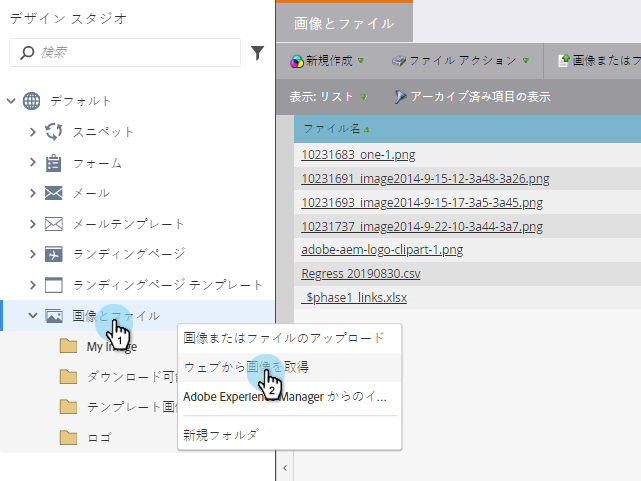

# フォルダを使用した画像とファイルの整理 {#organize-your-images-and-files-using-folders}

フォルダを作成すると、画像やファイルを移動したり、必要な画像のセットのみを表示したり、特定のフォルダに直接アップロードしたりできます。

1. 「 **Design** Studio ****」に移動します。

   

1. 左のメニューで「** Images and Files**」を右クリックし、「 **New Folder**」を選択します。

   

1. 新しいフォルダーが表示されたら、名前を付けます。

   

1. 「 **画像とファイル**」に移動し、目的のフォルダーにドラッグ&amp;ドロップできるようになりました。

   

ハイフィーブ！ フォルダーutopiaに設定されました。

>[!MORELIKETHIS]
>
>* [アップロードされた画像とファイルの検索](search-uploaded-images-and-files.md)

>

