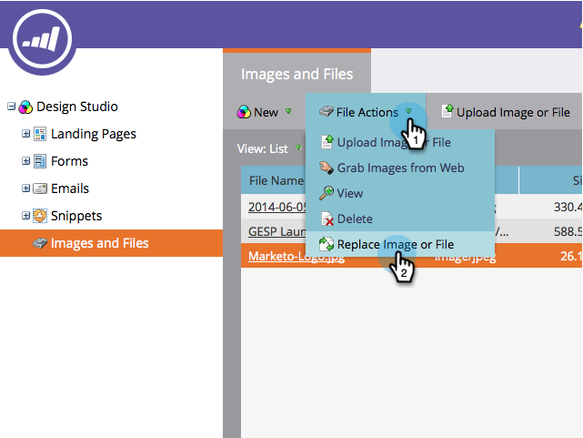
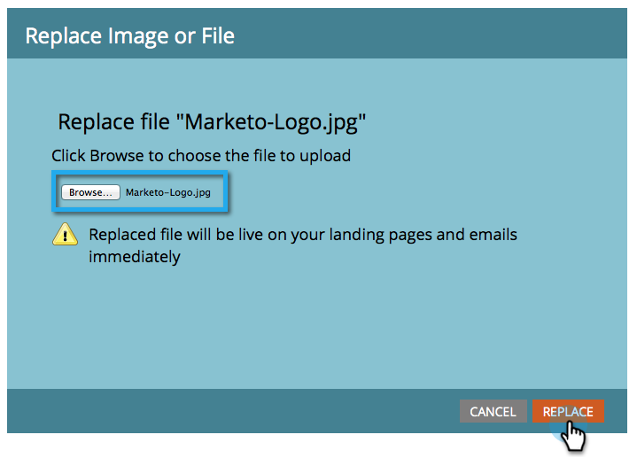

# アップロードした画像またはファイルの置換 {#replace-an-uploaded-image-or-file}

1. 「 **Design** Studio ****」に移動します。

   

1. 「 **画像****と****ファイル**」をクリックし、置換するファイルを選択します。

   

   >[!TIP]
   >
   >アップロードした画像やファイルを [検索することもできます](search-uploaded-images-and-files.md)。

1. 「 **ファイルのアクション** 」をクリックし、「画像を置換」または「ファイル ****」を選択します。

   

1. 現在のファイルを置き換えるコンピューター上のファイルを参照し、選択します。

   

   >[!NOTE]
   >
   >共有フォルダーからファイルを選択できない場合は、そのファイルをハードドライブに保存し、そこから選択してください。

1. 「 **Choose File** 」の横に表示されるファイルが正しいことを確認し、「 **Replace**」をクリックします。

   

>[!NOTE]
>
>置き換えるファイルの名前は、前のファイル名に合わせて変更されます。

やった！

>[!MORELIKETHIS]
>
>* [アップロードされた画像とファイルの検索](search-uploaded-images-and-files.md)
>* [アップロードされた画像またはファイルのURLの検索](find-the-url-of-an-uploaded-image-or-file.md)

>

