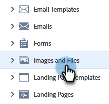

# アップロードした画像またはファイルの置き換え {#replace-an-uploaded-image-or-file}

1. **[!UICONTROL Design Studio]** に移動します。

   

1. クリック **[!UICONTROL 画像とファイル]**.

   

1. 置き換えるアセットを選択します。 次をクリック： **[!UICONTROL 画像とファイルのアクション]** ドロップダウンして「 」を選択します。 **[!UICONTROL 画像またはファイルの置換]**.

   

1. 置き換えファイルを探すコンピューターをドラッグ&amp;ドロップするか、参照します。

   

   >[!NOTE]
   >
   >置き換えるファイルの種類は、元のファイルと同じ（例：.jpg）にする必要があります

1. 置き換えファイルを選択したら、 **[!UICONTROL 置換]**.

   

   >[!NOTE]
   >
   >置き換えるファイルの名前は、前のファイルの名前に合わせて変更されます。

これで完了です。

>[!MORELIKETHIS]
>
>* [アップロードされた画像とファイルの検索](/help/marketo/product-docs/demand-generation/images-and-files/search-uploaded-images-and-files.md){target="_blank"}
>* [アップロードされた画像またはファイルの URL を見つける](/help/marketo/product-docs/demand-generation/images-and-files/find-the-url-of-an-uploaded-image-or-file.md){target="_blank"}
