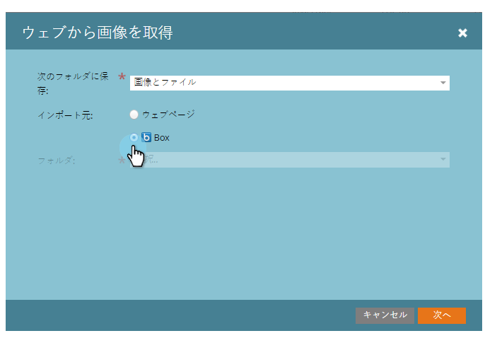
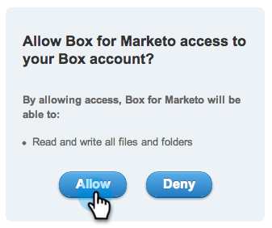
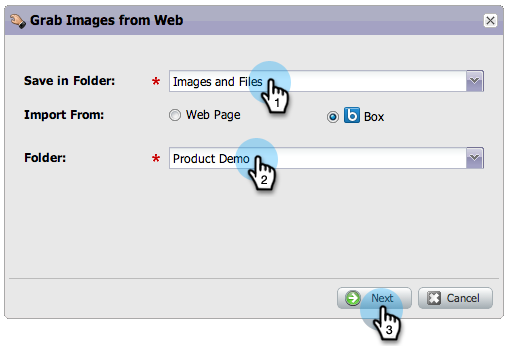

# ボックスからの画像とファイルのアップロード{#upload-images-and-files-from-box}

Boxからファイルをアップロードして、ランディングページや電子メールに使用できます。

1. **デザイン** **スタジオ**&#x200B;に移動します。

   

1. 「**画像とファイル**へ移動」に移動します。 「**ファイルアクション**」をクリックし、「**Webから画像をグラブ**」を選択します。

   

1. 「**ボックス**」をクリックします。

   

1. Boxログインを入力します。

   

1. マーケティング担当者がBoxアカウントにアクセスできるようにします。

   

1. ファイルの保存先を選択します。 次に、アップロード元の&#x200B;**ボックス**&#x200B;フォルダを選択します。 「**次へ**」をクリックします。

   

1. アップロードするファイルを選択します。 「**インポート**」をクリックします。

   

これで、ランディングページや電子メールでファイルを使用できる状態になりました。