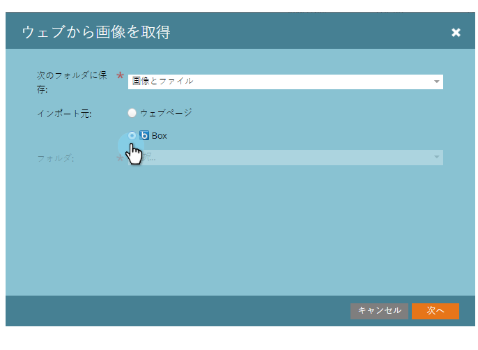

# Box から画像とファイルをアップロードする {#upload-images-and-files-from-box}

ランディングページやメールで使用するファイルを Box からアップロードすることができます。

1. 「**[!UICONTROL Design Studio]**」に移動します。

   

1. 「**[!UICONTROL 画像とファイル]**」に移動します。 「**[!UICONTROL ファイルアクション]**」をクリックして「**[!UICONTROL Web から画像を取得]**」を選択します。

   

1. 「**[!UICONTROL Box]**」をクリックします。

   

1. [!DNL Box] のログイン情報を入力します。

   

1. Marketo から [!DNL Box] アカウントへのアクセスを許可します。

   

1. ファイルを保存する場所を選択します。 次に、アップロード元の **[!DNL Box]** フォルダーを選択します。 「**[!UICONTROL 次へ]**」をクリックします。

   

1. アップロードするファイルを選択します。 「**[!UICONTROL 読み込み]**」をクリックします。

   

これで、ファイルをランディングページやメールで使用する準備が整いました。
