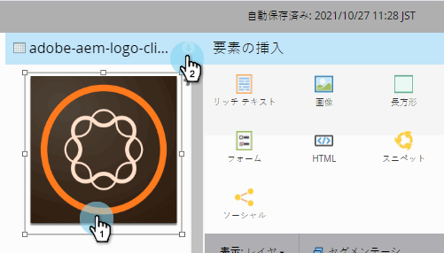
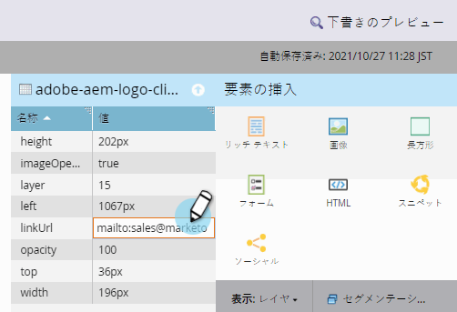

# フリ追加ーフォームランディングページ画像へのリンク{#add-a-link-to-a-free-form-landing-page-image}

>[!PREREQUISITES]
>
>* [フ追加リーフォームランディングページへの画像](add-an-image-to-a-free-form-landing-page.md)

>

>[!NOTE]
>
>これはフリーフォームランディングページにのみ適用されます。

1. ランディングページに追加した画像を選択し、**プロパティシートを展開します。**

   

1. 「**リンクURL」にmailtoリンクを入力します。**

   

   素晴らしい仕事！ これで、Marketoランディングページに電子メールリンクとしての画像が作成されました。

   

