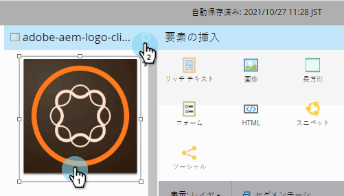
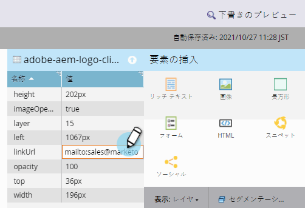

# フリーフォームランディングページ画像へのリンクの追加 {#add-a-link-to-a-free-form-landing-page-image}

>[!PREREQUISITES]
>
>[フリーフォームランディングページへの画像の追加](/help/marketo/product-docs/demand-generation/landing-pages/free-form-landing-pages/add-an-image-to-a-free-form-landing-page.md)

>[!NOTE]
>
>これが該当するのは、フリーフォームランディングページだけです。

1. ランディングページに追加した画像を選択し、**[!UICONTROL プロパティシート]**&#x200B;を展開します。

   

1. **[!UICONTROL linkUrl]**&#x200B;にメール送信リンクを入力してください。

   

   Marketo ランディングページの画像に mailto リンクが設定されました。

   
