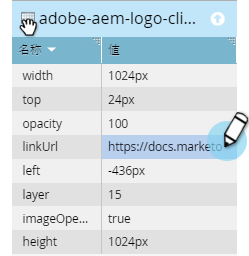

# フリ追加ーフォームランディングページ内の画像へのリンク {#add-a-link-to-an-image-in-a-free-form-landing-page}

ランディングページ上の画像を別のページ/サイトへのリンクにしたい場合 これが方法です。

>[!PREREQUISITES]
>
>* [フ追加リーフォームランディングページへの画像](add-an-image-to-a-free-form-landing-page.md)

>

1. リンクを追加する画像をクリックします。

   

1. [ **プロパティシート**]を展開します。

   

1. **linkUrl **boxにリンクをコピーまたは入力します。

   

   おめでとう！ これで、ランディングページ上の画像へのリンクが正常に追加されました。 これで、ページに [プレビューして実行中のページを表示できます](../../../../product-docs/demand-generation/landing-pages/landing-page-actions/preview-a-landing-page.md) 。

>[!TIP]
>
>必ずページをテストしてください。

>[!NOTE]
>
>**関連記事**
>
>* [ランディングページのプレビュー](../../../../product-docs/demand-generation/landing-pages/landing-page-actions/preview-a-landing-page.md)

>

