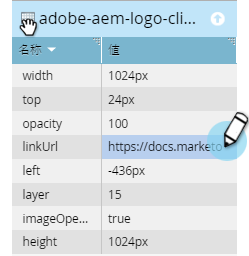

# フリーフォームランディングページで画像にリンクを追加する {#add-a-link-to-an-image-in-a-free-form-landing-page}

ランディングページ上の画像を別のページやサイトへのリンクにしたい場合、手順は以下のとおりです。

>[!PREREQUISITES]
>
>[フリーフォームランディングページへの画像の追加](/help/marketo/product-docs/demand-generation/landing-pages/free-form-landing-pages/add-an-image-to-a-free-form-landing-page.md)

1. リンクを追加する画像をクリックします。

   

1. 「**[!UICONTROL プロパティシート]**」を展開します。

   

1. 「**[!UICONTROL linkUrl]**」ボックスにリンクをコピーまたは入力します。

   

   これで完了です。これで、ランディングページ上の画像へのリンクが正常に追加されました。[ページをプレビュー](/help/marketo/product-docs/demand-generation/landing-pages/landing-page-actions/preview-a-landing-page.md)すると、実際にそれを見ることができます。

>[!TIP]
>
>ページを必ずテストしてください。
