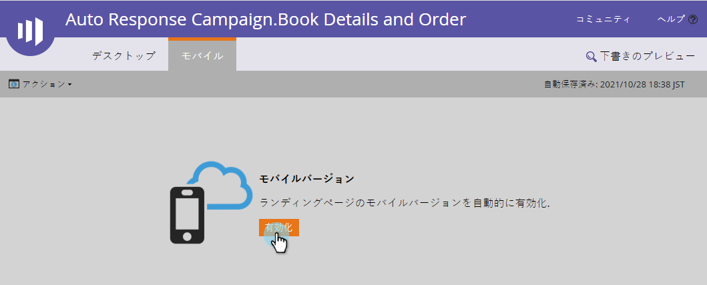
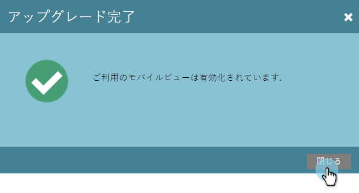
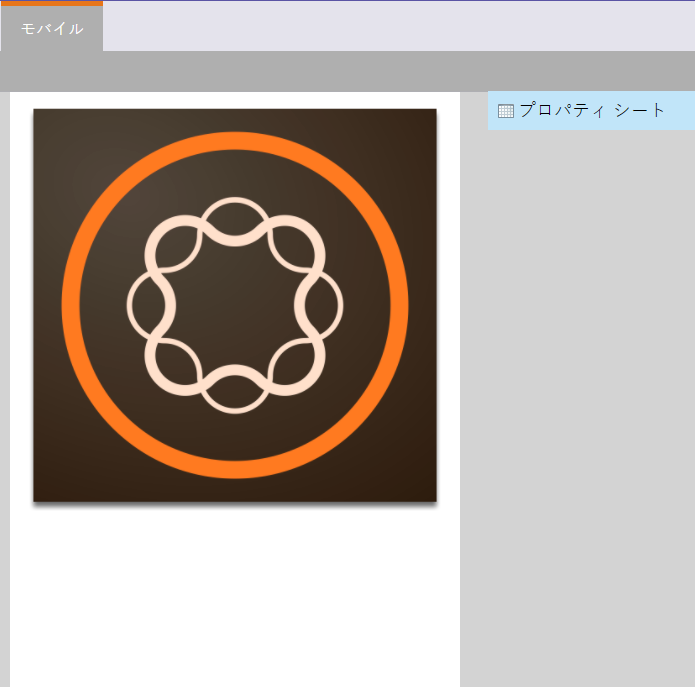

# フ追加リーフォームランディングページ用のモバイル表示{#add-a-mobile-view-for-your-free-form-landing-page}

スマートフォンでは、フリーフォームのランディングページを見栄えよく見せるのが簡単です。

>[!NOTE]
>
>モバイル表示は、幅が480ピクセル以下の画面で機能します。 つまりスマートフォンです デバイスの解像度](http://mydevice.io/devices/.)の[情報を以下に示します。

1. **マーケティングアクティビティ**&#x200B;に移動します。

   

1. 自由形式のランディングページを選択します。

   

1. 「**ドラフトを編集**」をクリックします。

   

1. 「**モバイル**」タブをクリックします。

   

1. 「**アクティブ化**」をクリックします。

   

   >[!CAUTION]
   >
   >フリーフォームテンプレートはアップグレードが必要な場合があります。 このメッセージが表示された場合は、既存のフリーフォームランディングページテンプレートをモバイル互換[にする方法について、すばやくお読みください。](../../../../product-docs/demand-generation/landing-pages/landing-page-templates/make-an-existing-free-form-landing-page-template-mobile-compatible.md)

1. 素晴らしい！ これで、ランディングページーのモバイルバージョンがアクティベートされました。 「**閉じる」をクリックします。 **

   

   これで[モバイル表示](customize-mobile-view-for-your-free-form-landing-page.md)をカスタマイズできます。

   

>[!MORELIKETHIS]
>
>* [フリーフォームランディングページ用のモバイル表示のカスタマイズ](customize-mobile-view-for-your-free-form-landing-page.md)

>

