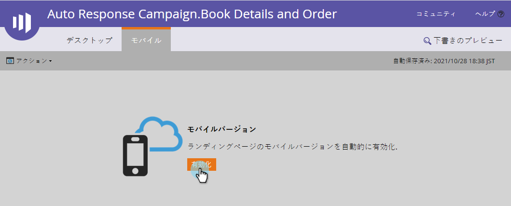
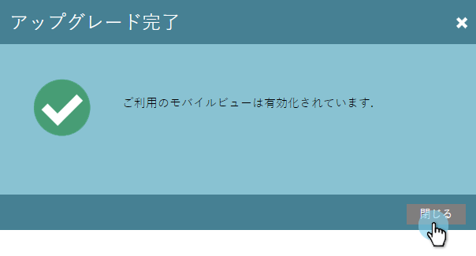
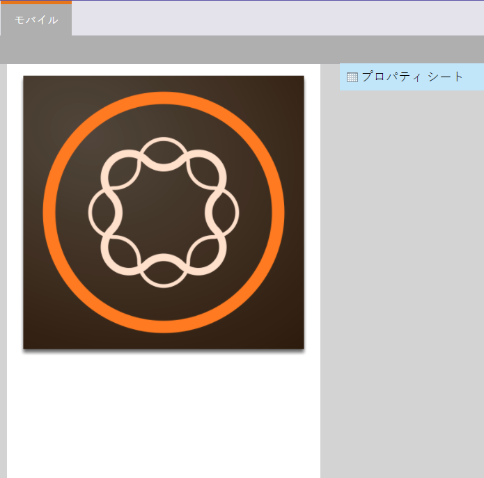

# フリーフォームランディングページのモバイル表示の追加 {#add-a-mobile-view-for-your-free-form-landing-page}

フリーフォームのランディングページをスマートフォンで適切に表示するように最適化できます。

>[!NOTE]
>
>モバイルビューは、幅が 480 px 以下の画面で機能します。 つまり、スマートフォンです。 デバイスの解像度に関する詳細情報は、[こちら](https://www.mydevice.io/)でご覧ください。

1. **[!UICONTROL マーケティングアクティビティ]**&#x200B;に移動します。

   

1. フリーフォームランディングページを選択します。

   

1. **[!UICONTROL ドラフトの編集]**&#x200B;をクリックします。

   

1. 「**[!UICONTROL モバイル]**」タブをクリックします。

   

1. 「**[!UICONTROL アクティベート]**」をクリックします。

   

   >[!CAUTION]
   >
   >フリーフォームテンプレートのアップグレードが必要な場合があります。 そのメッセージが表示された場合は、[既存のフリーフォームランディングページテンプレートをモバイルに対応させる](/help/marketo/product-docs/demand-generation/landing-pages/landing-page-templates/make-an-existing-free-form-landing-page-template-mobile-compatible.md)方法について簡単に参照してください。

1. これで、ランディングページのモバイルバージョンがアクティベートされました。 「**[!UICONTROL 閉じる]**」をクリックします。

   

   次に、[モバイル表示をカスタマイズ](/help/marketo/product-docs/demand-generation/landing-pages/free-form-landing-pages/customize-mobile-view-for-your-free-form-landing-page.md)することができます。

   
