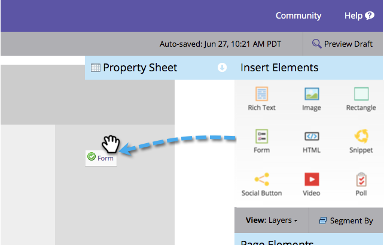

# フリーフォームランディングページに新しいフォームを追加する {#add-a-new-form-to-a-free-form-landing-page}

ランディングページをフォームに紹介するフォームをランディングページに紹介する

>[!PREREQUISITES]
>
>* [フォームの作成](/help/marketo/product-docs/demand-generation/forms/creating-a-form/create-a-form.md)
>* [フリーフォームランディングページの作成](/help/marketo/product-docs/demand-generation/landing-pages/free-form-landing-pages/create-a-free-form-landing-page.md)

1. **[!UICONTROL マーケティングアクティビティ]**&#x200B;に移動します。

   

1. ランディングページを選択して、「**[!UICONTROL ドラフトの編集]**」をクリックします。

   

1. **[!UICONTROL フォーム]**&#x200B;要素をページにドラッグ&amp;ドロップします。

   

1. 追加するフォームを探して選択します。

   

1. フォローアップページを選択するときには、3 つのオプションがあります。

   * **[!UICONTROL ランディングページ]** - Marketo ランディングページを選択する場合
   * **[!UICONTROL 外部 URL]**  - 使用したい任意の URL を選択する場合
   * **[!UICONTROL 定義済みのフォーム]** - フォームレベルで定義されている設定を使用します。

   >[!NOTE]
   >
   >**定義**
   >
   >フォローアップページとは、フォームを送信した後で表示されるページです。

1. 次に「**[!UICONTROL 挿入]**」をクリックします。

   

   うまくいきました。

ランディングページエディターを閉じて、[ランディングページのドラフトを承認](/help/marketo/product-docs/demand-generation/landing-pages/understanding-landing-pages/approve-unapprove-or-delete-a-landing-page.md)します。
