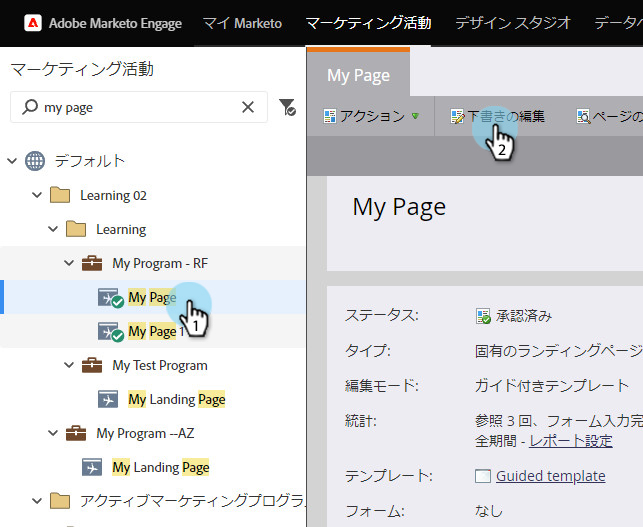
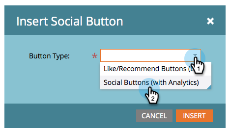

# フ追加リーフォームランディングページへのソーシャルボタン {#add-a-social-button-to-a-free-form-landing-page}

ソーシャルボタンを使用すると、ユーザーはコンテンツを友達と共有できます。 これをフリーフォームランディングページ、Facebook、Webサイトにドロップします。

>[!NOTE]
>
>**可用性**
>
>この機能を購入していないお客様もいます。 詳細については、セールス担当者にお問い合わせください。

1. 自由形式のランディングページに移動し、「ドラフトを **編集**」をクリックします。

   

1. 右側の要素から **Social****ボタン** (Button)をドラッグします。

   

1. 「 **ソーシャルボタン（Analyticsで）」を選択します。**

   

   ランディングページがアクティブになると、 [Socialダッシュボード上のソーシャルボタン（Analyticsを使用）によって生成されたアクティビティを確認できます](../../../../product-docs/demand-generation/social/social-functions/view-social-performance.md)。

   代わりに「いいね！」/「おすすめ」ボタン(Lite)を追加する場合は、 [ランディングページのパフォーマンスレポートで共有数を確認します](../../../../product-docs/demand-generation/landing-pages/understanding-landing-pages/landing-page-performance-report.md)。

1. ドロップダウンメニューから **「新規作成** 」を選択します。

   >[!NOTE]
   >
   >また、 **新規** / **新規ローカルアセットを選択して、プログラム内にソーシャルボタンを作成することもできます。**

1. ソーシャルボタンに名前を付け、「 **コピー元** 」から「なし **」を選択して** 、「 **挿入」をクリックします。**

   

   >[!TIP]
   >
   >時間を節約するために、「 **コピー元****** 」オプションを使用して、既存のソーシャルボタンからすべての設定をコピーできます。

   [ランディングページをFacebookに投稿し](../../../../product-docs/demand-generation/facebook/publish-landing-pages-to-facebook.md) 、Webサイトに「ソーシャル」ボタンを [置く](../../../../product-docs/demand-generation/social/social-functions/deploy-social-on-your-website.md)

おめでとう！ ランディングページにソーシャルボタンが追加されました。 必ずランディングページを承認してください。

>[!NOTE]
>
>**関連記事**
>
>完了ですが、必要に応じてソーシャルボタンの設定を変更できます。 ボタンスタイルの [カスタマイズ](../../../../product-docs/demand-generation/social/configuring-social-actions/customize-social-app-button.md) 、または表示される共有メッセージの [編集に関する開始](../../../../product-docs/demand-generation/social/configuring-social-actions/configure-social-sign-up-share-flow.md) 。
