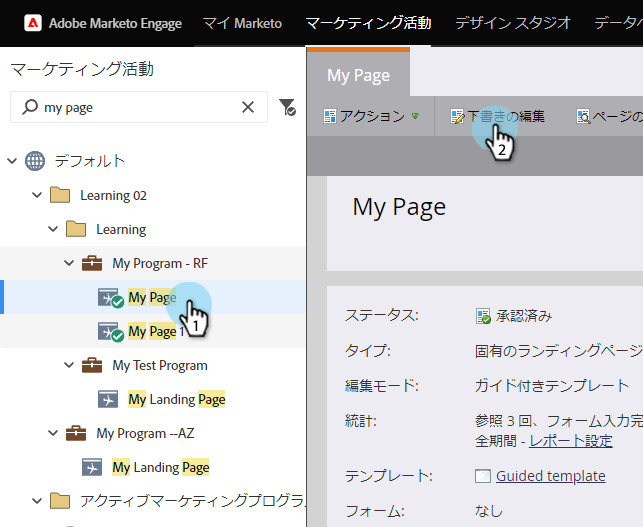

# フリーフォームランディングページへのソーシャルボタンの追加 {#add-a-social-button-to-a-free-form-landing-page}

Social ボタンは、人々に、友人とコンテンツを共有するよう促します。 フリーフォームランディングページ、Facebook、Web サイトにドロップします。

>[!AVAILABILITY]
>
>すべての Marketo Engage ユーザがこの機能を購入しているわけではありません。 詳しくは、アドビのアカウントチーム（担当のアカウントマネージャー）にお問い合わせください。

1. フリーフォームランディングページに移動して、「**[!UICONTROL 下書きの編集]**」をクリックします。

   

1. 右側の要素から&#x200B;**[!UICONTROL ソーシャルボタン]**&#x200B;をドラッグします。

   

1. **[!UICONTROL ソーシャルボタン（Analytics 使用）]**&#x200B;を選択します。

   

   ランディングページがアクティブになると、_ソーシャルボタン（Analytics 使用）によって生成されたアクティビティがソーシャルダッシュボード_&#x200B;に表示されます。

   代わりに[!UICONTROL いいね！／おすすめボタン（Lite）]を追加する場合は、[ランディングページのパフォーマンスレポート](/help/marketo/product-docs/demand-generation/landing-pages/understanding-landing-pages/landing-page-performance-report.md)で共有数を確認してください。

1. ドロップダウンメニューから「**[!UICONTROL 新規作成]**」を選択します。

   >[!NOTE]
   >
   >**[!UICONTROL 新規]**／**[!UICONTROL 新しいローカルアセット]**&#x200B;を選択して、プログラム内にソーシャルボタンを作成することもできます。

1. ソーシャルボタンに名前を付け、「**[!UICONTROL コピー元]**」で「**[!UICONTROL なし]**」を選択し、「**[!UICONTROL 挿入]**」を選択します。

   

   >[!TIP]
   >
   >時間を節約するために、「**[!UICONTROL コピー元]**」オプションを使用して、既存のソーシャルボタンからすべての設定をコピーできます。

   [ランディングページを Facebook に公開する &#x200B;](/help/marketo/product-docs/demand-generation/facebook/publish-landing-pages-to-facebook.md)_Web サイトにソーシャルボタンを配置する_

これで完了です。 ランディングページにソーシャルボタンを追加しました。 ランディングページは必ず承認してください。

>[!MORELIKETHIS]
>
>完了しましたが、必要に応じてソーシャルボタンの設定を変更できます。 まず、_ボタンのスタイルをカスタマイズ_&#x200B;するか、表示する&#x200B;_共有メッセージを編集_&#x200B;します。
