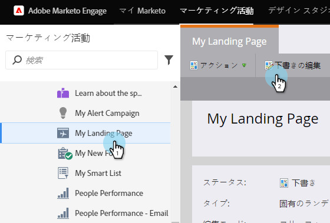
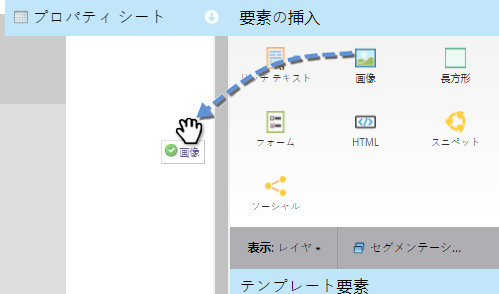
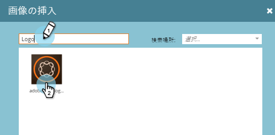
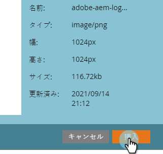
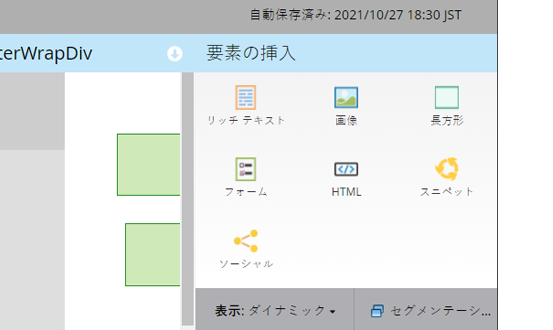

# フ追加リーフォームランディングページへの画像 {#add-an-image-to-a-free-form-landing-page}

>[!NOTE]
>
>**前提条件**
>
>* [マー追加ケティング担当者向けの画像とファイル](../../../../product-docs/demand-generation/images-and-files/add-images-and-files-to-marketo.md)

>

1. 自由形式のランディングページを選択し、「 **ドラフトを** 編集 **」をクリックします**。

   

1. エディターで、 **画像** 要素の上にドラッグします。

   

1. 選択した画像を探して選択します。

   

1. [ **挿入**]をクリックします。

   

   素晴らしい仕事！ 自由形式のランディングページに画像を追加しました。

   

