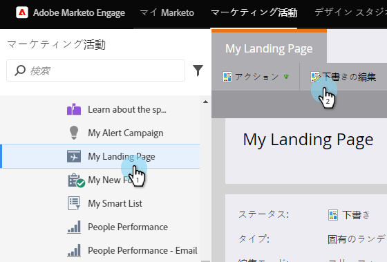
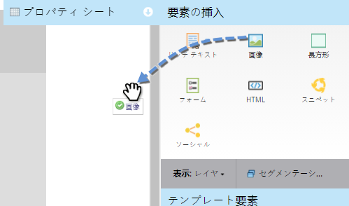
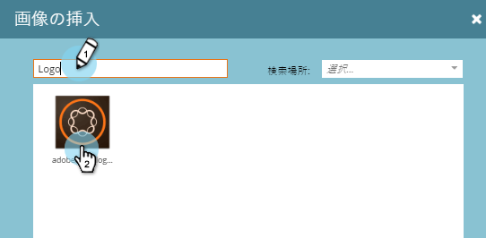
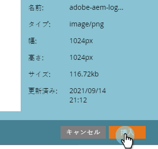
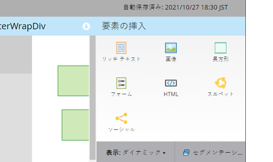

# フリーフォームランディングページへの画像の追加 {#add-an-image-to-a-free-form-landing-page}

>[!PREREQUISITES]
>
>[画像とファイルを Marketo に追加](/help/marketo/product-docs/demand-generation/images-and-files/add-images-and-files-to-marketo.md)

1. フリーフォームランディングページを選択し、「**[!UICONTROL 下書きの編集]**」をクリックします。

   

1. エディターで、「**[!UICONTROL 画像]**」要素をドラッグします。

   

1. 目的の画像を探して選択します。

   

1. 次に「**[!UICONTROL 挿入]**」をクリックします。

   

   これで完了です。フリーフォームランディングページに画像が追加されました。

   
