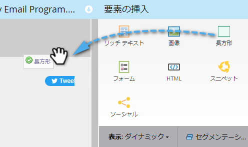
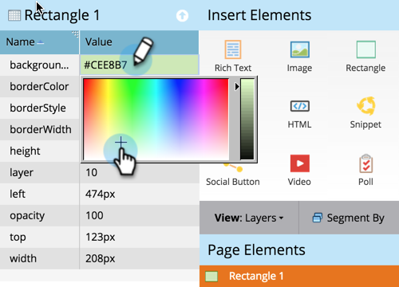

# 自由形式ランディングページへの長方形の追加{#adding-a-rectangle-to-a-free-form-landing-page}

ランディングページ上の長方形は、テキストの領域をハイライトするのに適しています。

1. フリーフォームランディングページを選択し、「**編集** **ドラフト**」をクリックします。

   

   >[!NOTE]
   >
   >フリーフォームランディングページデザイナーが新しいウィンドウで開きます。

1. **長方形**&#x200B;要素の上にドラッグします。

   

1. 長方形を選択し、**プロパティ** **シート**&#x200B;を使用して、必要な変更を行います。

   >[!TIP]
   >
   >ドラッグ&amp;ドロップを使用して、長方形の移動やサイズ変更を行うことができます。 また、キーボードの矢印を試してみてください。 ヒント：Shiftキーを押しながら矢印キーを押すと、長方形を10ピクセルずつ移動できます。

   

おめでとう！ これで、自由形式のランディングページ上に長方形を作成できます。
