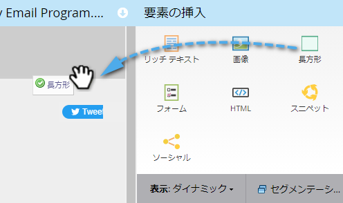

# フリーフォームランディングページへの長方形の追加 {#adding-a-rectangle-to-a-free-form-landing-page}

ランディングページの長方形は、コンテンツセクションを強調表示または視覚的に分離するために使用できます。

1. フリーフォームランディングページを選択し、「**[!UICONTROL ドラフトを編集]**」をクリックします。

   

   >[!NOTE]
   >
   >フリーフォームランディングページデザイナーが新しいウィンドウで開きます。

1. **[!UICONTROL 長方形]**&#x200B;要素をドラッグします。

   

1. 長方形を選択し、「**[!UICONTROL プロパティシート]**」を使用して必要に応じて変更を加えます。

   >[!TIP]
   >
   >ドラッグ＆ドロップを使用して、長方形の移動やサイズ変更をおこなうことができます。 また、キーボードの矢印を試してみてください。 ヒント：Shift キーを押しながら矢印キーを押すと、10 ピクセルずつ長方形を移動できます。

   

フリーフォームのランディングページに長方形を追加できるようになりました。
