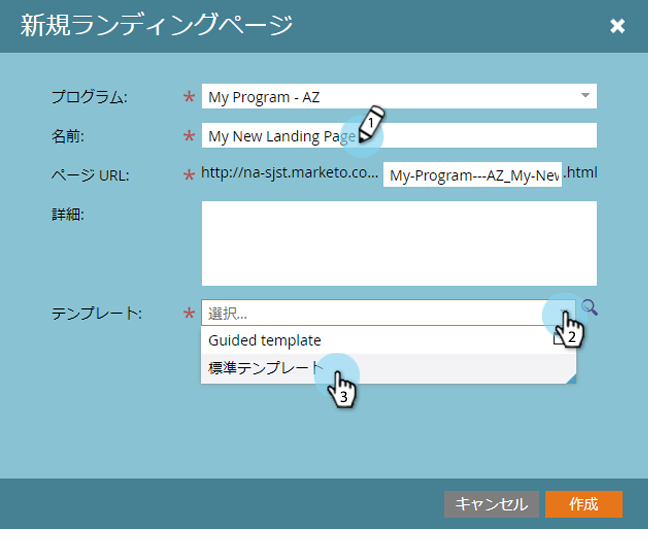
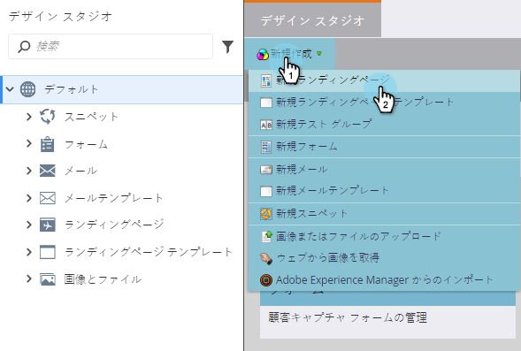

# フリーフォームランディングページの作成{#create-a-free-form-landing-page}

フリーフォームランディングページは、プログラムのローカルアセットとして、またはDesign Studioで作成し、グローバルに使用することができます。

>[!NOTE]
>
>ランディングページモードは、そのテンプレートによって定義されます。 [フリーフォームおよびガイド付きランディングページテンプレートにつ](../../../../product-docs/demand-generation/landing-pages/understanding-landing-pages/understanding-free-form-vs-guided-landing-pages.md) いて詳しく説明します。

## プログラム{#create-a-free-form-landing-page-in-a-program}でのフリーフォームランディングページの作成

1. **マーケティングアクティビティ**&#x200B;に移動します。

   

1. プログラムをクリックします。

   

1. 「**新規**」をクリックします。 「**新しいローカルアセット**」を選択します。

   

1. **ランディングページ**&#x200B;をクリックします。

   

1. ランディングページに名前を付け、ドロップダウンから自由形式のテンプレートを選択します。

   >[!NOTE]
   >
   >アイコンのないテンプレートは自由形式です。 自由形式のテンプレートを使用すると、すべてのカスタマイズが可能です。

   

1. 「**作成**」をクリックします。

   

>[!TIP]
>
>URLは、プログラム名とランディングページ名から自動的に構築されます。 URLを変更するには、**ページURL**&#x200B;フィールドを編集します。

## Design Studio {#create-a-free-form-landing-page-in-design-studio}で自由形式ランディングページを作成する

1. **デザイン** **スタジオ**&#x200B;に移動します。

   

1. 「**新しい**」をクリックし、「**新しいランディングページ**」をクリックします。

   

1. ランディングページに名前を付け、ドロップダウンから自由形式のテンプレートを選択します。

   

1. 「**作成**」をクリックします。

   

>[!TIP]
>
>「**作成**」をクリックした後すぐにランディングページを開かないようにするには、「新しいページにエディタを開く」をオフにします。

