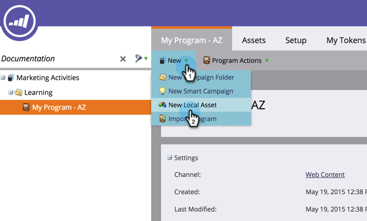
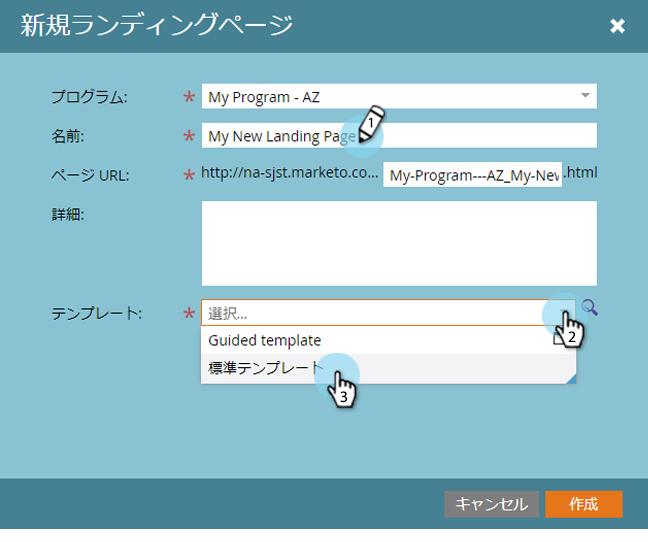
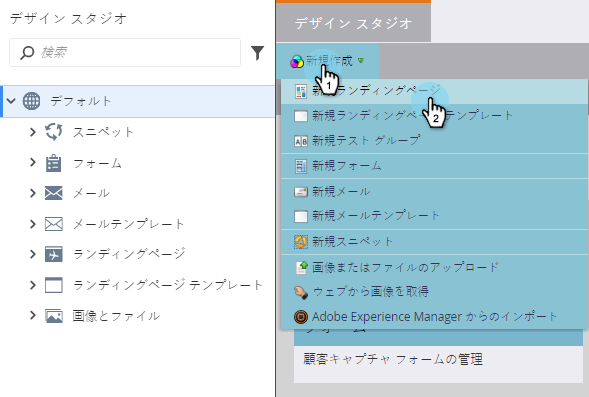

# フリーフォームランディングページを作成する {#create-a-free-form-landing-page}

フリーフォームのランディングページは、プログラムのローカルアセットとして、または[!UICONTROL デザインスタジオ]で作成してグローバルに使用できます。

>[!NOTE]
>
>ランディングページモードは、テンプレートによって定義されます。 フリーフォームおよびガイド付きのランディングページテンプレートについての詳細は[こちら](/help/marketo/product-docs/demand-generation/landing-pages/understanding-landing-pages/understanding-free-form-vs-guided-landing-pages.md)です。

## プログラムでフリーフォームランディングページを作成する {#create-a-free-form-landing-page-in-a-program}

1. **[!UICONTROL マーケティングアクティビティ]**&#x200B;に移動します。

   

1. プログラムをクリックします。

   

1. 「**[!UICONTROL 新規]**」をクリックします。 「**[!UICONTROL 新規ローカルアセット]**」を選択します。

   

1. 「**[!UICONTROL ランディングページ]**」をクリックします。

   

1. ランディングページに名前を付け、ドロップダウンからフリーフォームテンプレートを選択します。

   >[!NOTE]
   >
   >アイコンのないテンプレートはフリーフォームです。 フリーフォームテンプレートを使用すると、完全なカスタマイズが可能です。

   

1. 「**[!UICONTROL 作成]**」をクリックします。

   

>[!TIP]
>
>URL は、プログラムとランディングページの名前から自動的に生成されます。 URL を変更するには、**[!UICONTROL ページ URL]** フィールドを編集します。

## Design Studio でフリーフォームランディングページを作成する {#create-a-free-form-landing-page-in-design-studio}

1. **[!UICONTROL Design Studio]** に移動します。

   

1. 「**[!UICONTROL 新規作成]**」をクリックし、「**[!UICONTROL 新規ランディングページ]**」をクリックします。

   

1. ランディングページに名前を付け、ドロップダウンからフリーフォームテンプレートを選択します。

   

1. 「**[!UICONTROL 作成]**」をクリックします。

   

>[!TIP]
>
>「**[!UICONTROL 作成]**」をクリックした直後にエディターを開きたくない場合は、「[!UICONTROL 新しいページに対してランディングページエディターを開く]」のチェックを外します。
