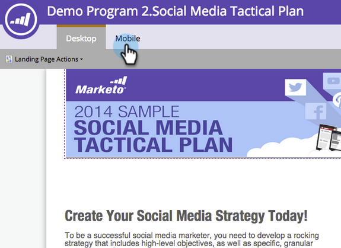
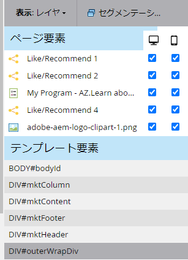
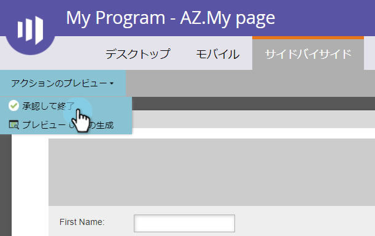

# フリーフォームランディングページ用のモバイル表示のカスタマイズ{#customize-mobile-view-for-your-free-form-landing-page}

>[!PREREQUISITES]
>
>[フ追加リーフォームランディングページ用のモバイル表示](/help/marketo/product-docs/demand-generation/landing-pages/free-form-landing-pages/add-a-mobile-view-for-your-free-form-landing-page.md)

フリーフォームランディングページのモバイル表示はほとんど自動的ですが、カスタマイズすることができます。 これが方法です。

1. 自由形式のランディングページを選択します。

   

1. 「**ドラフトを編集**」をクリックします。

   

1. 「**モバイル**」タブをクリックします。

   

## モバイルとデスクトップ表示{#mobile-vs-desktop-view}

「ページエレメント」の下に、（デスクトップ）アイコンと（モバイル）アイコンが表示されます。 これにより、異なる要素を動的に表示/非表示にできます。

デフォルトでは、デスクトップ表示ー上のすべてがモバイル表示ーに表示されます。

>[!NOTE]
>
>長方形はモバイル表示に表示されません。

## 重要な知識：{#important-things-to-know}

* 画像はモバイルデバイスの幅に合わせて拡大されます。 画像を小さくしたい場合は、リッチテキスト要素を取り込み、そこから画像を追加します。
* Forms2.0フォームのみを使用します。 応答性が高く、自動的に調整されます。
* 編集できるテンプレート要素は、BODY#bodyid（モバイル）の1つだけです。 これを使用して背景色を変更できます。

   

## モバイル表示から要素を非表示にする{#hide-an-element-from-the-mobile-view}

>[!TIP]
>
>携帯電話が少ない方が便利です。 単語数を減らすと、より幸せな顧客を見つけることができます。

1. 要素を非表示にするには、mobile列の下にある対応するチェックボックスをクリックします。

   

1. 完璧！ その要素は、モバイル表示に表示されなくなります。

   

## モバイル表示追加{#add-an-element-to-the-mobile-view}への要素

>[!TIP]
>
>モバイル表示向けに特別な（短い）コンテンツを作成します。

1. 要素を追加するには、自由形式ランディングページにドラッグ&amp;ドロップします。

   

   エレメントがモバイル表示でのみ表示されるように設定されていることを確認します。

   

>[!TIP]
>
>モバイル表示は、異なるページ要素配置を持つこともできます。 自由形式ランディングページ上で移動したり、**ページエレメント**&#x200B;に表示されるオブジェクトの順番を変更したりするには、ドラッグ&amp;ドロップします。

## プレビューモバイル表示{#preview-mobile-view}

1. **プレビュードラフト**&#x200B;をクリックします。

   

1. 何か格好いいもの見たい？ 「**並べて**」を選択します。

   

1. デスクトップ版とモバイル版のランディングページを同時に表示できるようになりました。

   

1. お気に入りの場合は、「**承認して閉じる**」をクリックします。

   

   >[!NOTE]
   >
   >このプレビューはインタラクティブではありません。 スマートフォンの表示は全て少し異なります ランディングページの動作を正確に確認するには、いくつかのデバイスでランディングページをプレビューすることをお勧めします。

楽しんで！

>[!MORELIKETHIS]
>
>[既存のフリーフォームランディングページテンプレートとモバイルとの互換性の設定](/help/marketo/product-docs/demand-generation/landing-pages/landing-page-templates/make-an-existing-free-form-landing-page-template-mobile-compatible.md)
