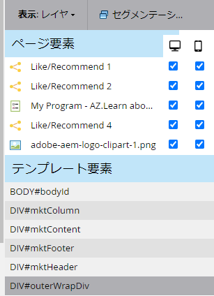
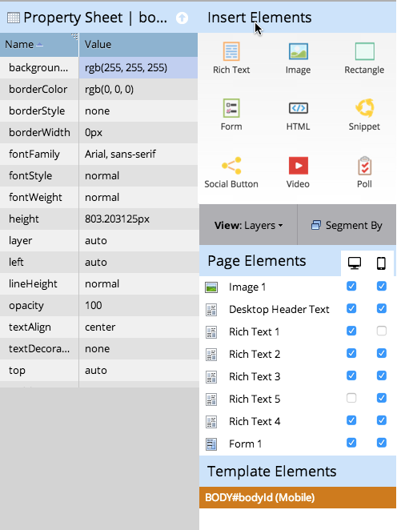
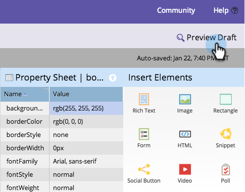
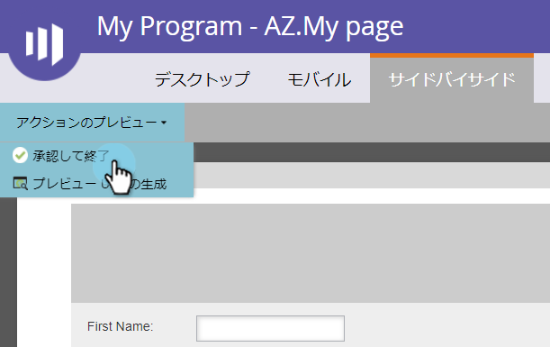

# フリーフォームランディングページのモバイル表示をカスタマイズする {#customize-mobile-view-for-your-free-form-landing-page}

>[!PREREQUISITES]
>
>[フリーフォームランディングページのモバイル表示の追加](/help/marketo/product-docs/demand-generation/landing-pages/free-form-landing-pages/add-a-mobile-view-for-your-free-form-landing-page.md)

フリーフォームランディングページのモバイル表示は、ほとんど自動ですが、カスタマイズできます。

1. フリーフォームランディングページを選択します。

   

1. **[!UICONTROL ドラフトの編集]**&#x200B;をクリックします。

   

1. 「**[!UICONTROL モバイル]**」タブをクリックします。

   

## モバイル表示とデスクトップ表示+ {#mobile-vs-desktop-view}

ページ要素の下に、（デスクトップ）アイコンと（モバイル）アイコンがあります。 これにより、様々な要素の表示／非表示を動的に切り替えることができます。

デフォルトでは、デスクトップ表示のすべての項目がモバイル表示に表示されます。

>[!NOTE]
>
>長方形は、モバイルビューには表示されません。

## 留意事項 {#important-things-to-know}

* 画像はモバイルデバイスの幅に合わせて拡大されます。 画像を小さくしたい場合は、リッチテキスト要素を取り込み、そこから画像を追加します。
* Forms 2.0 フォームのみを使用してください。 これらはレスポンシブで、自動的に調整されます。
* 編集可能なテンプレート要素は 1 つだけです（BODY#bodyid (Mobile)）。 これを使用して、背景色を変更できます。

  

## モバイル表示から要素を非表示にする {#hide-an-element-from-the-mobile-view}

>[!TIP]
>
>携帯電話では少ないほうが効果的です。

1. 要素を非表示にするには、モバイル列の下にある、対応するチェックボックスをクリックします。

   

1. その要素は、モバイル表示には表示されなくなります。

   

## モバイル表示に要素を追加する {#add-an-element-to-the-mobile-view}

>[!TIP]
>
>モバイルビュー用に短いコンテンツを作成します。

1. 要素を追加するには、フリーフォームランディングページに要素をドラッグ&amp;ドロップします。

   

   要素がモバイル表示でのみ表示されるように設定されていることを確認します。

   

>[!TIP]
>
>モバイル表示でページ要素の配置を変更することもできます。 フリーフォームランディングページ上で移動するか、ドラッグ&amp;ドロップを使用して&#x200B;**[!UICONTROL ページ要素]**&#x200B;に表示されているオブジェクトを並べ替えます。

## モバイル表示をプレビュー {#preview-mobile-view}

1. 「**[!UICONTROL 下書きをプレビュー]**」をクリックします。

   

1. **[!UICONTROL Side By Side]**&#x200B;を選択すると、デスクトップ版とモバイル版を同時に比較できます。

   

1. ランディングページのデスクトップ版とモバイル版を同時に表示できるようになりました。

   

1. 「**[!UICONTROL 承認して閉じる]**」をクリックします。

   

   >[!NOTE]
   >
   >プレビューはインタラクティブではありません。 スマートフォンの表示は、それぞれ少し異なります。 ランディングページがどのように動作するかを正確に確認するには、いくつかのデバイスでランディングページをプレビューすることをお勧めします。

>[!MORELIKETHIS]
>
>[既存のフリーフォームランディングページテンプレートのモバイルとの互換性の確保](/help/marketo/product-docs/demand-generation/landing-pages/landing-page-templates/make-an-existing-free-form-landing-page-template-mobile-compatible.md)
