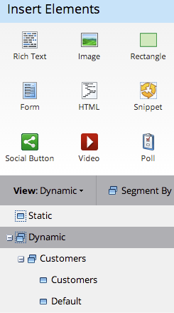
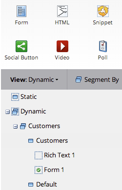

# フリーフォームランディングページでの動的コンテンツの使用{#use-dynamic-content-in-a-free-form-landing-page}

動的コンテンツをランディングページで使用すると、ターゲット情報をオーディエンスに提供できます。

>[!PREREQUISITES]
>
>* [セグメントの作成](../../../../product-docs/personalization/segmentation-and-snippets/segmentation/create-a-segmentation.md)
>* [フリーフォームランディングページの作成](create-a-free-form-landing-page.md)
>* [フ追加リーフォームランディングページへの新しいフォーム](add-a-new-form-to-a-free-form-landing-page.md)

>

## 追加セグメント{#add-segmentation}

1. **マーケティングアクティビティ**&#x200B;に移動します。

   

   ランディングページを選択し、「ドラフトを編集」をクリックします。

   

   「セグメント基準」をクリックします。

   

   セグメント名を入力し、「保存」をクリックします。

   

   セグメントとそのセグメントが右側の「動的」の下に表示されます。

   

>[!NOTE]
>
>デフォルトでは、すべてのランディングページ要素は静的です。

## 要素を動的にする{#make-element-dynamic}

1. 動的コンテンツ要素を&#x200B;**静的**&#x200B;下から&#x200B;**動的にドラッグ&amp;ドロップします。**

   

1. 要素&#x200B;**静的**&#x200B;または&#x200B;**動的**&#x200B;を要素&#x200B;**設定から作成することもできます。**

   

## 動的コンテンツの適用{#apply-dynamic-content}

1. セグメントの下の要素を選択し、設定アイコンをクリックして、「**編集**」をクリックします。 各セグメントに対して同じ手順を繰り返します。

   

1. 緑のチェックマークは、そのセグメントに固有のコンテンツを示します。 空白は、デフォルトのセグメントコンテンツを示します。

   

>[!CAUTION]
>
>デフォルトのセグメントコンテンツブロックに対する変更は、すべてのセグメントに適用されます。

>[!TIP]
>
>様々なセグメントのコンテンツを変更する前に、デフォルトのランディングページを作成します。

よし！ ターゲットコンテンツを送信できるようになりました。

>[!NOTE]
>
>**関連記事**
>
>* [動的コンテンツを使用したランディングページのプレビュー](../../../../product-docs/demand-generation/landing-pages/landing-page-actions/preview-a-landing-page-with-dynamic-content.md)
>* [電子メールでの動的コンテンツの使用](../../../../product-docs/email-marketing/general/functions-in-the-editor/using-dynamic-content-in-an-email.md)

>

