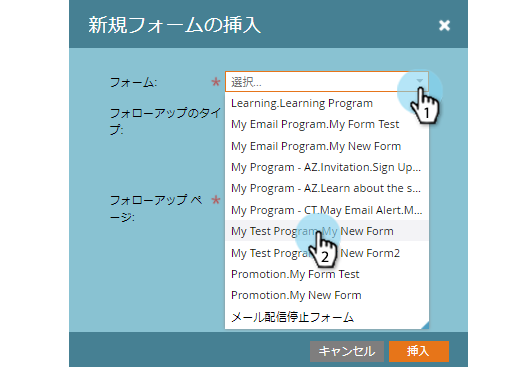
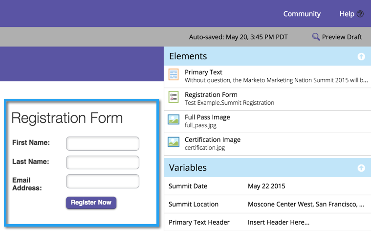

# ガイド付きランディングページにフォームを追加する {#add-a-form-to-a-guided-landing-page}

ランディングページをフォームに紹介するフォームをランディングページに紹介する

>[!PREREQUISITES]
>
>[ガイド付きランディングページテンプレートを作成する](/help/marketo/product-docs/demand-generation/landing-pages/guided-landing-pages/create-a-guided-landing-page.md)

1. 「**マーケティングアクティビティ**」エリアに移動します。

   

1. ランディングページを探して選択し、「**ドラフトを編集**」をクリックします。

   

   >[!NOTE]
   >
   >ガイド付きランディングページで使用できる要素は、テンプレートによって定義されます。要素パネルにフォームが表示されていない場合は、新しいテンプレートを選択するか、テンプレート作成者にお問い合わせください。

1. 要素パネルで「**フォーム**」をダブルクリックします。

   

1. 追加するフォームを選択します。

   

1. フォローアップページを選択するときには、3 つのオプションがあります。

   * ランディングページ - Marketo ランディングページを選択します。
   * 外部 URL - 使用したい任意の URL を選択します。
   * 定義済みのフォーム - フォームレベルで定義されている設定を使用します。

   >[!NOTE]
   >
   >フォローアップページとは、フォームを送信した後で表示されるページです。

1. この例では、「フォーム定義」を使用します。次に「**挿入**」をクリックします。

   

   うまくいきました。

   

次に、ランディングページエディターを閉じて、[ランディングページのドラフトを承認](/help/marketo/product-docs/demand-generation/landing-pages/understanding-landing-pages/approve-unapprove-or-delete-a-landing-page.md)します。
