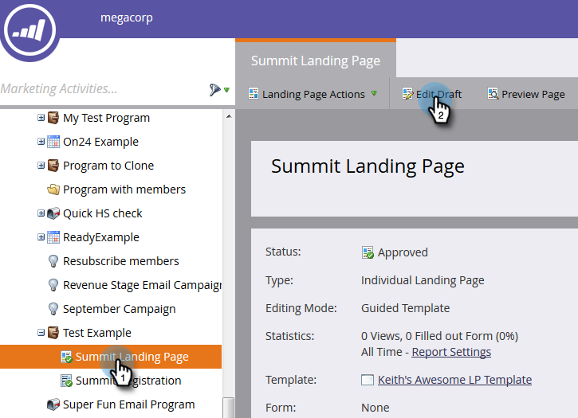

# ガイド付きランディングページ追加のフォーム{#add-a-form-to-a-guided-landing-page}

フォーム、ランディングページを満たす。 ランディングページ、形式を満たす。

>[!PREREQUISITES]
>
>[ガイド付きランディングページの作成](/help/marketo/product-docs/demand-generation/landing-pages/guided-landing-pages/create-a-guided-landing-page.md)

1. **マーケティングアクティビティ**&#x200B;エリアに移動します。

   

1. ランディングページを探して選択し、「**ドラフトを編集**」をクリックします。

   

   >[!NOTE]
   >
   >ガイド付きランディングページで使用できる要素は、テンプレートによって定義されます。 要素パネルにフォームが表示されない場合は、新しいテンプレートを選択するか、テンプレートの作成者にお問い合わせください。

1. 重複パネルで&#x200B;**フォーム**&#x200B;を要素でクリックします。

   

1. 追加するフォームを選択します。

   

1. フォローアップページを選択する際には、次の3つのオプションがあります。

   * ランディングページ — マーケティングランディングページの選択
   * 外部URL — 必要なURLを選択します。
   * Form Defined — フォームレベルで定義された設定を使用します。

   >[!NOTE]
   >
   >フォローアップページは、訪問者がフォームを送信した後に表示されるページです。

1. この例では、「フォーム定義」を使用します。 「**挿入**」をクリックします。

   

   うまくいった！

   

次に、ランディングページエディターを閉じて[ランディングページドラフト](/help/marketo/product-docs/demand-generation/landing-pages/understanding-landing-pages/approve-unapprove-or-delete-a-landing-page.md)を承認します。
