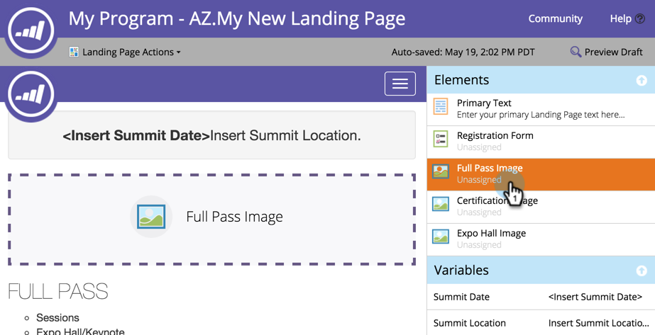
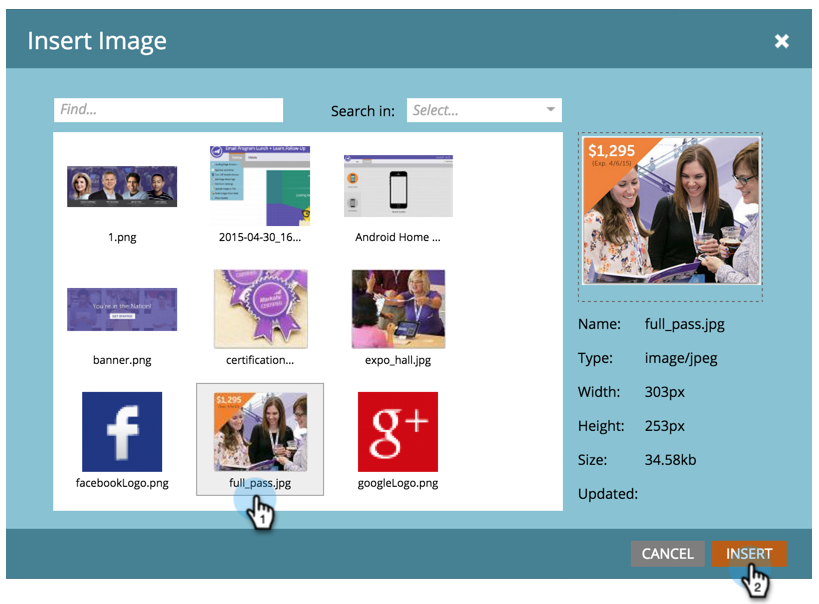

# ガイド付きランディングページに画像を追加する {#add-an-image-to-a-guided-landing-page}

フリーフォームランディングページとは異なり、ガイド付きランディングページには、事前に定義され、ロックされた画像を追加するためのスペースがあります。

1. ガイド付きランディングページを選択します。 **[!UICONTROL ドラフトの編集]**&#x200B;をクリックします。

   

1. 編集する画像をクリックします。 ランディングページキャンバス上で、要素プレースホルダーがハイライトされます。

   

1. 目的の画像を選択し、「**[!UICONTROL 挿入]**」をクリックします。

   

1. コンテンツは、エレメントのプレースホルダーに表示されます。

   >[!NOTE]
   >
   >画像のサイズ変更の方法は、テンプレートによって異なります。 ガイド付きランディングページテンプレートの詳細については、[こちら](/help/marketo/product-docs/demand-generation/landing-pages/landing-page-templates/create-a-guided-landing-page-template.md)を参照してください。

   

   >[!TIP]
   >
   >エディターでの画像のリンクの指定は、現在サポートされていません。 代わりに、リッチテキスト要素を使用します。
