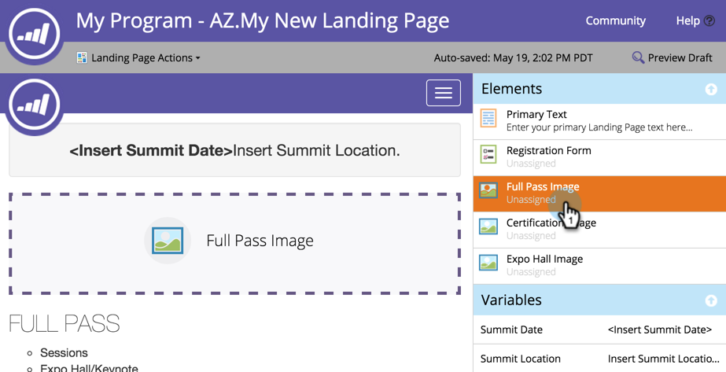

# ガイド付追加きランディングページの画像 {#add-an-image-to-a-guided-landing-page}

フリーフォームランディングページとは異なり、ガイド付きランディングページには、画像を追加する場所にあらかじめ定義され、ロックされたスペースがあります。

1. ガイド付きランディングページを選択します。 「ドラフト **を編集**」をクリックします。

   

1. 編集する画像をクリックします。 要素のプレースホルダーがランディングページキャンバスに照らされます。

   

1. 使用する画像を選択し、「 **挿入**」をクリックします。

   

1. コンテンツが要素プレースホルダーに表示されます。

   >[!NOTE]
   >
   >画像のサイズ変更は、テンプレートに依存します。 ガイド付きランディングページテンプレ [ートの詳細](../../../../product-docs/demand-generation/landing-pages/landing-page-templates/create-a-guided-landing-page-template.md)。

   

   >[!TIP]
   >
   >エディターでの画像のリンクの指定は、現在サポートされていません。 代わりに、リッチテキスト要素を使用します。

