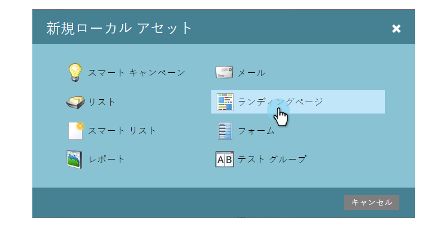

# ガイド付きランディングページの作成 {#create-a-guided-landing-page}

>[!NOTE]
>
>ランディングページモードは、そのテンプレートによって定義されます。 [フリーフォームおよびガイド付きランディングページテンプレートについて詳しく説明します](/help/marketo/product-docs/demand-generation/landing-pages/understanding-landing-pages/understanding-free-form-vs-guided-landing-pages.md) 。

>[!PREREQUISITES]
>
>カスタムテンプレートを使用するには、まずガイド付きランディングページテンプレートを [作成する必要があります](/help/marketo/product-docs/demand-generation/landing-pages/landing-page-templates/create-a-guided-landing-page-template.md)。

## プログラムでのガイド付きランディングページの作成 {#create-a-guided-landing-page-in-a-program}

ガイド付きランディングページは、プログラムのローカルアセットとして、またはDesign Studioで作成し、グローバルに使用することができます。

1. 「 **マーケティングアクティビティ**」に移動します。

   

1. プログラムを選択します。

   

1. 「 **新規** 」ドロップダウンをクリックします。 「 **新規ローカルアセット**」を選択します。

   

1. 「 **ランディングページ**」を選択します。

   

1. ランディングページに名前を付けます。 「 **テンプレート** 」ドロップダウンをクリックし、「 **ガイド付きテンプレート**」を選択します。

   >[!NOTE]
   >
   >ガイド付きランディングページテンプレートの横には  アイコンが表示されます。 ガイド付きテンプレートは、完全にレスポンシブな状態を維持できるように構造化されています。

   

## Design Studioでのランディングページの作成 {#create-a-landing-page-in-design-studio}

1. 「 **Design Studio**」に移動します。

   

1. 「 **新規** 」ドロップダウンをクリックします。 「 **新規ランディングページ**」を選択します。

   

1. ランディングページに名前を付けます。 「 **テンプレート** 」ドロップダウンをクリックし、「 **ガイド付きテンプレート**」を選択します。

   

1. 「 **作成**」をクリックします。

   

>[!TIP]
>
>URLは、プログラム名とランディングページ名から自動的に構築されます。 URLを変更するには、「 **ページURL** 」フィールドを編集します。
>
>「 **作成** 」をクリックした直後にエディターを開かないようにするには、「エディターで **開く**」チェックボックスをオフにします。
