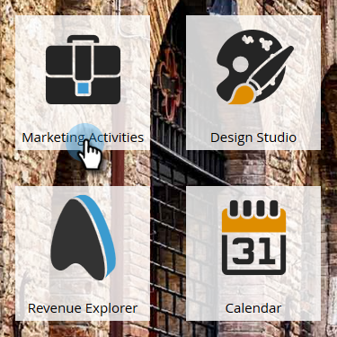

# ガイド付きランディングページテンプレートを作成する {#create-a-guided-landing-page}

>[!NOTE]
>
>ランディングページモードは、テンプレートによって定義されます。 フリーフォームおよびガイド付きのランディングページテンプレートについての詳細は[こちら](/help/marketo/product-docs/demand-generation/landing-pages/understanding-landing-pages/understanding-free-form-vs-guided-landing-pages.md)です。

>[!PREREQUISITES]
>
>カスタムテンプレートを使用するには、まず[ガイド付きランディングページテンプレートを作成](/help/marketo/product-docs/demand-generation/landing-pages/landing-page-templates/create-a-guided-landing-page-template.md)する必要があります。

## プログラムでガイド付きランディングページを作成する {#create-a-guided-landing-page-in-a-program}

ガイド付きランディングページは、プログラムのローカルアセットとして、または[!UICONTROL デザインスタジオ]で作成してグローバルに使用できます。

1. **[!UICONTROL マーケティングアクティビティ]**&#x200B;に移動します。

   

1. プログラムを選択します。

   

1. **[!UICONTROL 新規]**&#x200B;ドロップダウンをクリックします。 「**[!UICONTROL 新規ローカルアセット]**」を選択します。

   

1. 「**[!UICONTROL ランディングページ]**」を選択します。

   

1. ランディングページに名前を付けます。 **[!UICONTROL テンプレート]**&#x200B;ドロップダウンをクリックして「**[!UICONTROL ガイド付きテンプレート]**」を選択します。

   >[!NOTE]
   >
   >ガイド付きランディングページテンプレートの横には アイコンが表示されます。 ガイド付きテンプレートは、完全にレスポンシブであり続けるように構造化されています。

   

## Design Studio でガイド付きランディングページを作成する {#create-a-landing-page-in-design-studio}

1. 「**[!UICONTROL Design Studio]**」に移動します。

   

1. **[!UICONTROL 新規]**&#x200B;ドロップダウンをクリックします。 「**[!UICONTROL 新規ランディングページ]**」を選択します。

   

1. ランディングページに名前を付けます。 **[!UICONTROL テンプレート]**&#x200B;ドロップダウンをクリックして「**[!UICONTROL ガイド付きテンプレート]**」を選択します。

   

1. 「**[!UICONTROL 作成]**」をクリックします。

   

>[!TIP]
>
>URL は、プログラムとランディングページの名前から自動的に生成されます。 URL を変更するには、**[!UICONTROL ページ URL]** フィールドを編集します。
>
>**[!UICONTROL 作成]**&#x200B;をクリックした直後にエディターを開けないようにする場合は、「**[!UICONTROL エディターで開く]**」チェックボックスをオフにします。
