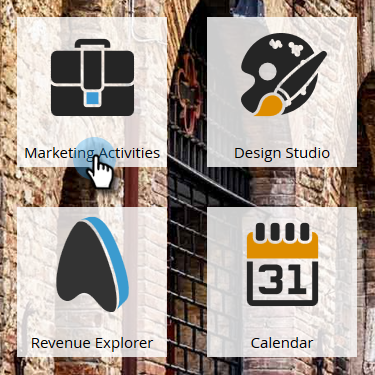

# ガイド付きランディングページテンプレートを作成する {#create-a-guided-landing-page}

>[!NOTE]
>
>ランディングページモードは、テンプレートによって定義されます。フリーフォームおよびガイド付きのランディングページテンプレートについての詳細は[こちら](/help/marketo/product-docs/demand-generation/landing-pages/understanding-landing-pages/understanding-free-form-vs-guided-landing-pages.md)です。

>[!PREREQUISITES]
>
>カスタムテンプレートを使用するには、まず[ガイド付きランディングページテンプレートを作成](/help/marketo/product-docs/demand-generation/landing-pages/landing-page-templates/create-a-guided-landing-page-template.md)する必要があります。

## プログラムでガイド付きランディングページを作成する {#create-a-guided-landing-page-in-a-program}

ガイド付きランディングページは、プログラムのローカルアセットとして、または Design Studio で作成してグローバルに使用できます。

1. 「**マーケティング活動**」に移動します。

   

1. プログラムを選択します。

   

1. **新規**&#x200B;ドロップダウンをクリックします。「**新規ローカルアセット**」を選択します。

   

1. 「**ランディングページ**」を選択します。

   

1. ランディングページに名前を付けます。**テンプレート**&#x200B;ドロップダウンをクリックして「**ガイド付きテンプレート**」を選択します。

   >[!NOTE]
   >
   >ガイド付きランディングページテンプレートの横には、アイコンが表示されます。ガイド付きテンプレートは、完全にレスポンシブであり続けるように構造化されています。

   

## Design Studio でガイド付きランディングページを作成する {#create-a-landing-page-in-design-studio}

1. 「**Design Studio**」に移動します。

   

1. **新規**&#x200B;ドロップダウンをクリックします。「**新規ランディングページ**」を選択します。

   

1. ランディングページに名前を付けます。**テンプレート**&#x200B;ドロップダウンをクリックして「**ガイド付きテンプレート**」を選択します。

   

1. 「**作成**」をクリックします。

   

>[!TIP]
>
>URL は、プログラムとランディングページの名前から自動的に生成されます。URL を変更するには、**ページ URL** フィールドを編集します。
>
>「**作成**」をクリックしたときにすぐにエディターが開かれないようにするには、「**エディターで開く**」チェックボックスをオフにします。
