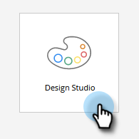
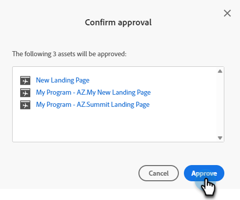

# 複数のランディングページを一度に承認する {#approve-multiple-landing-pages-at-once}

1. 「**[!UICONTROL Design Studio]**」に移動します。

   

1. 「**[!UICONTROL ランディングページ]**」をクリックします。

   

1. 目的のランディングページを選択します。

   

   >[!TIP]
   >
   >実際のランディングページ名をクリックしないでください。これらはリンクで、ページ自体に移動します。

1. ランディングページを選択した状態で、**[!UICONTROL ランディングページのアクション]**&#x200B;ドロップダウンをクリックして、「**[!UICONTROL 承認]**」を選択します。

   

1. 「**[!UICONTROL 承認]**」をクリックします。

   

   >[!TIP]
   >
   >上記の手順は、承認解除や削除など、他の一括オプションにも使用できます。
