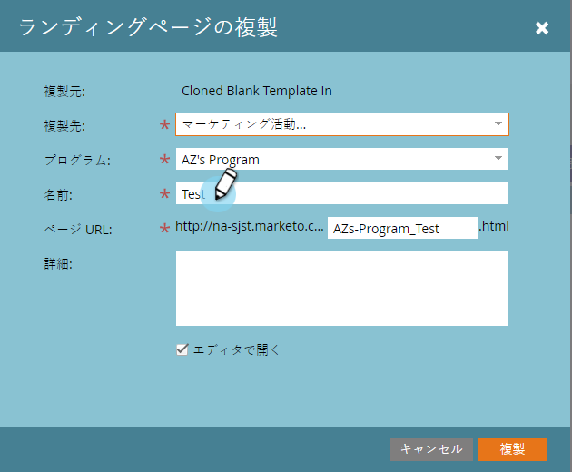
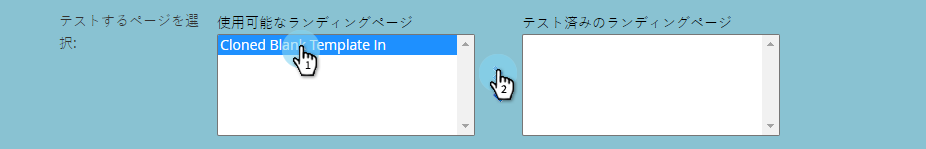

# ランディングページテストグループを複製する {#cloning-a-landing-page-test-group}

Design Studio では、ランディングページのテストグループを検索して複製できます。

1. 未承認のページを右クリックします。「**複製**」を選択します。

   

1. 複製したページに新しい&#x200B;**名前**&#x200B;を付けます。複製したページは、現在のフォルダーの一番下に表示されます。

   

1. 次に「**新規**」、「**新規テストグループ**」の順にクリックして、新しいテストグループを作成します。

   

1. 新規ランディングページ作成ダイアログで、「**名前**」に新しいテストグループ名を入力します。

   

1. ダイアログの下側にある「**使用可能なランディングページ**」で複製したページを選択し、右向き矢印をクリックして「**テスト済みのランディングページ**」に追加します。この作業は、このグループに追加したいすべてのランディングページに対しておこなってください。

   

1. 作業が終わったら、「**作成**」をクリックします。

   

1. テストグループを起動する準備ができたら、ツリー内でグループを右クリックして、「**テストグループの承認**」を選択します。

   

   訪問回数とフォームの完了数をアクティブに追跡し、どのランディングページのパフォーマンスが最も高いかを確認できるようになります。
