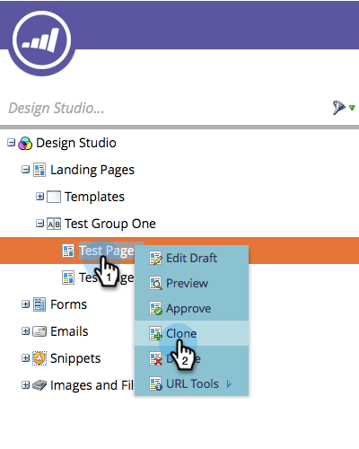
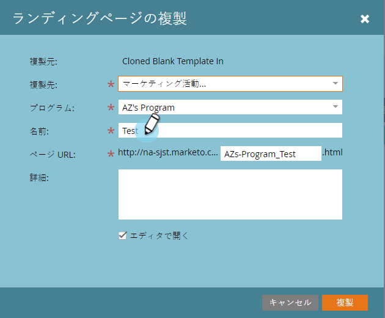
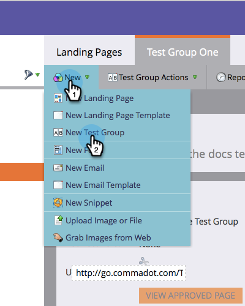
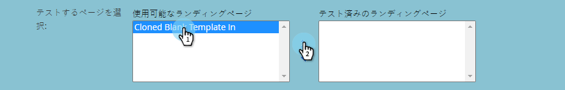
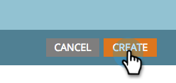
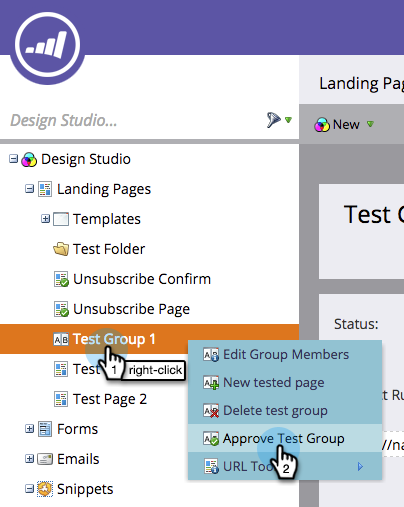

# ランディングページテストグループを複製する {#cloning-a-landing-page-test-group}

[!UICONTROL デザインスタジオ]では、ランディングページのテストグループを検索して複製できます。

1. 未承認のページを右クリックします。 「**[!UICONTROL 複製]**」を選択します。

   

1. 複製したページに新しい&#x200B;**[!UICONTROL 名前]**&#x200B;を付けます。 複製したページは、現在のフォルダーの一番下に表示されます。

   

1. 次に「**[!UICONTROL 新規]**」、「**[!UICONTROL 新規テストグループ]**」の順にクリックして、新しいテストグループを作成します。

   

1. 新規ランディングページ作成ダイアログで、「**[!UICONTROL 名前]**」に新しいテストグループ名を入力します。

   

1. ダイアログの下側にある「**[!UICONTROL 使用可能なランディングページ]**」で複製したページを選択し、右向き矢印をクリックして「**[!UICONTROL テスト済みのランディングページ]**」に追加します。 この作業は、このグループに追加したいすべてのランディングページに対しておこなってください。

   

1. 完了したら、**[!UICONTROL 作成]**&#x200B;をクリックします。

   

1. テストグループを起動する準備ができたら、ツリー内のグループを右クリックし、**[!UICONTROL テストグループを承認]**&#x200B;を選択します。

   

   これで、そのグループが訪問回数とフォームの完了数をアクティブにトラッキングし、どのランディングページのパフォーマンスが最も高いかを確認できるようになります。
