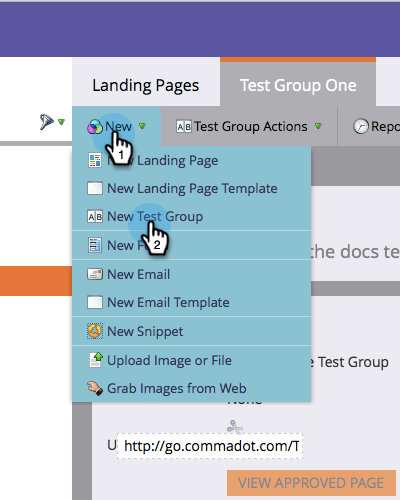

# ランディングページテストグループのクローン作成{#cloning-a-landing-page-test-group}

Design Studioで、ランディングページテストグループを検索して重複できます。

1. 未承認のページを右クリックします。 「**クローン**」を選択します。

   

1. この複製されたページに新しい&#x200B;**名前**&#x200B;を付けます。 複製されたページは、現在のフォルダーの下部に表示されます。

   

1. 次に、「**新規**」をクリックし、「**新しいテストグループ**」を選択して、新しいテストグループを作成します。

   

1. [新しいランディングページの作成]ダイアログで、新しいテストグループ&#x200B;**名前**&#x200B;を入力します。

   

1. ダイアログの下部で、**「使用可能なランディングページ**」リストで複製されたページを選択し、右向きの矢印をクリックして、**テスト済みランディングページ**&#x200B;に含めます。 このグループに含めるすべてのランディングページに対してこの操作を行います。

   

1. 完了したら、「**作成**」をクリックします。

   

1. テストグループを起動する準備が整ったら、ツリー内のグループを右クリックし、「**テストグループの承認**」を選択します。

   

   これで、グループは訪問数とフォームの完了数を積極的に追跡し、どのランディングページのパフォーマンスが最も良いかを確認できます。
