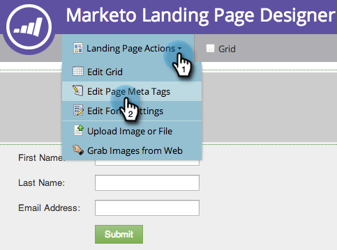

# ランディングページのタイトルとメタデータを編集{#edit-landing-page-title-and-metadata}

Marketorでは、SEOの目的に合わせてランディングページの[metaタグ](https://www.w3schools.com/tags/tag_meta.asp)を編集できるほか、HTMLの`<head>`部分をカスタマイズできます。

1. ランディングページを選択し、「**ドラフトを編集**」をクリックします。

   

   >[!NOTE]
   >
   >ランディングページデザイナーが新しいウィンドウで開きます。

1. 「**ランディングページアクション**」で、「**ページのメタタグを編集**」をクリックします。

   

1. ページの&#x200B;**タイトル**、**キーワード**、**説明**&#x200B;を入力します。 目的の&#x200B;**「ロボット**」オプションを選択し、HTML `<head>`セクションに必要なカスタムコンテンツを入力します。 「**保存**」をクリックします。

   

   >[!TIP]
   >
   >**ロボットって  何？**
   >
   >**index**:ページはWebで検索できます。**フォロー**:検索エンジンは、インデックス付きのページのリンクをたどることができます。

1. タグをいつでも編集し、ランディングページを承認します。
