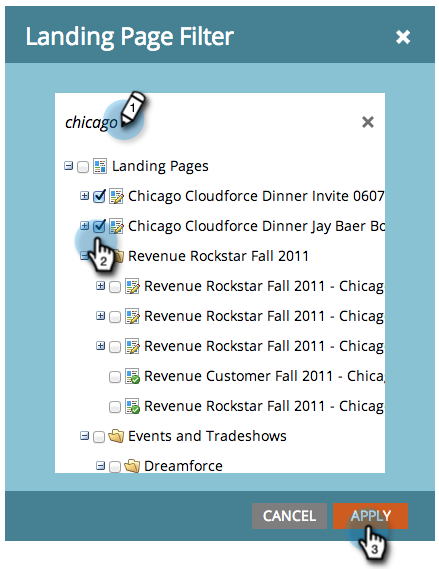

# ランディングページパフォーマンスレポートのフィルタリング {#filter-a-landing-page-performance-report}

プログラム（ローカルアセット）のランディングページ、[!UICONTROL デザインスタジオ]のランディングページ（グローバルアセット）、またはアーカイブされたランディングページに[ランディングページのパフォーマンスレポート](/help/marketo/product-docs/demand-generation/landing-pages/understanding-landing-pages/landing-page-performance-report.md)の焦点を合わせます。

1. **[!UICONTROL Analytics]**（または&#x200B;**[!UICONTROL マーケティングアクティビティ]**）エリアに移動します。

   

1. ナビゲーションツリーから任意のランディングページレポートを選択します。

   

1. 「**[!UICONTROL セットアップ]**」タブをクリックして、フィルターをドラッグします。

   

   * **[!UICONTROL デザインスタジオのランディングページ]：**&#x200B;[!UICONTROL デザインスタジオ]で管理されているグローバルアセット。
   * **[!UICONTROL マーケティングアクティビティランディングページ]**：「[!UICONTROL マーケティングアクティビティ]」タブのプログラム内のローカルアセット。
   * **[!UICONTROL アーカイブランディングページ]：**&#x200B;非アクティブの、既に使われていないランディングページ。

1. レポートに含めるフォルダーと特定のランディングページを選択します。

   

   >[!TIP]
   >
   >フォルダーを選択すると、レポートの実行時にフォルダーに含まれるすべての項目がレポートに含まれます。

1. 完了です！ 「**[!UICONTROL レポート]**」タブをクリックし、フィルターされたレポートを確認します。

   
