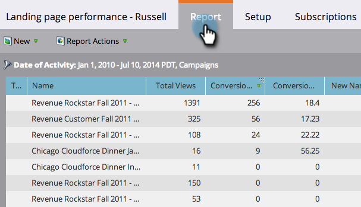

# ランディングページの効果レポートをフィルターする {#filter-a-landing-page-performance-report}

[ ランディングページのパフォーマンスレポート ](/help/marketo/product-docs/demand-generation/landing-pages/understanding-landing-pages/landing-page-performance-report.md) プログラムのランディングページ（ローカルアセット）、[!UICONTROL Design Studio] のランディングページ（グローバルアセット）、またはアーカイブされたランディングページにフォーカスします。

1. **[!UICONTROL Analytics]**（または&#x200B;**[!UICONTROL マーケティングアクティビティ]**）エリアに移動します。

   

1. ナビゲーションツリーから任意のランディングページレポートを選択します。

   

1. 「**[!UICONTROL セットアップ]**」タブをクリックして、フィルターをドラッグします。

   

   * **[!UICONTROL Design Studio ランディングページ &#x200B;]:** Design Studio[!UICONTROL &#x200B; で管理される &#x200B;] グローバルアセット。
   * **[!UICONTROL マーケティングアクティビティのランディングページ &#x200B;]:** マーケティングアクティビティ [!UICONTROL &#x200B; タブのプログラムのローカルアセットを &#x200B;] きます。
   * **[!UICONTROL アーカイブされたランディングページ &#x200B;]:** 非アクティブで廃止されたランディングページ。

1. レポートに含めるフォルダーと特定のランディングページを選択します。

   

   >[!TIP]
   >
   >フォルダーを選択すると、レポートの実行時にフォルダーに含まれるすべての項目がレポートに含まれます。

1. 完了です。「**[!UICONTROL レポート]**」タブをクリックし、フィルターされたレポートを確認します。

   
