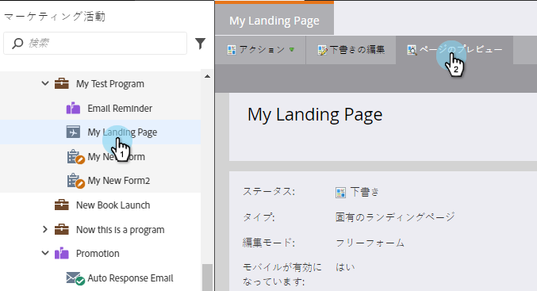

# 動的コンテンツを含むランディングページのプレビュー {#preview-a-landing-page-with-dynamic-content}

動的コンテンツを追加した後でランディングページをプレビューし、すべてが正しく表示されていることを確認します。

>[!PREREQUISITES]
>
>* [ランディングページでの動的コンテンツの使用](/help/marketo/product-docs/demand-generation/landing-pages/personalizing-landing-pages/use-dynamic-content-in-a-landing-page.md)
>* [ランディングページのプレビュー](/help/marketo/product-docs/demand-generation/landing-pages/landing-page-actions/preview-a-landing-page.md)

1. ランディングページを選択して、「**ページのプレビュー**」をクリックします。

   

1. ドロップダウンをクリックし、「**セグメント**」をクリックしてプレビューします。

   

これで完了です。これで、複数のセグメントにわたって、希望するランディングページを確実に機能させることができるようになりました。
