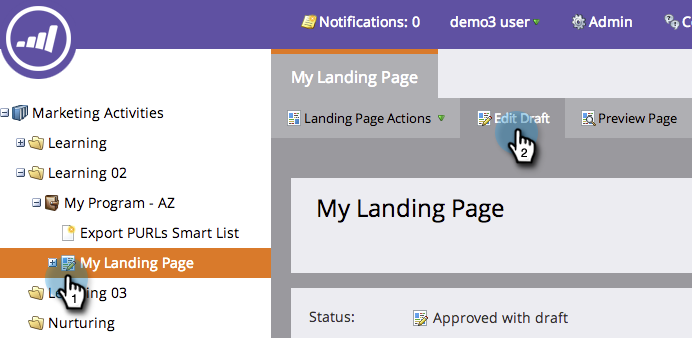
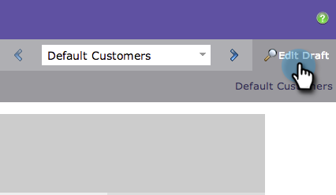

# ランディングページをプレビューする {#preview-a-landing-page}

ランディングページを公開する前に、ランディングページがどのように表示されるかを確認したい場合があります。

## ランディングページをプレビューする {#preview-a-landing-page-1}

1. ランディングページを選択して、「**ページのプレビュー**」をクリックします。

   

   >[!NOTE]
   >
   >ドラフトは作業中のバージョンで、顧客に表示されるライブバージョンではありません。

1. ランディングページを右クリックして、「**プレビュー**」を選択することもできます。

   

## ランディングページのドラフトをプレビューする {#preview-a-landing-page-draft}

1. ドラフトバージョンの承認済みランディングページを右クリックし、「**ドラフトのプレビュー**」をクリックします。

   

## 編集中にランディングページのドラフトをプレビューする {#preview-a-landing-page-draft-while-editing}

1. ランディングページを選択して、「**ドラフトの編集**」をクリックします。

   

1. ランディングページエディターで作業中に、「**ドラフトのプレビュー**」をクリックすることもできます。

   

1. 「**ドラフトの編集**」をクリックすると、簡単に編集作業に戻ることができます。

   

お疲れさまでした。ランディングページのプレビュー方法はこれで大丈夫ですね。
