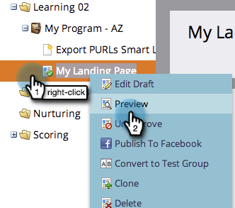

# ランディングページをプレビューする {#preview-a-landing-page}

本番稼働前に、ランディングページをプレビューして確認しましょう。

## ランディングページをプレビューする {#preview-a-landing-page-1}

1. ランディングページを選択して、「**[!UICONTROL ページのプレビュー]**」をクリックします。

   

   >[!NOTE]
   >
   >ドラフトは作業中のバージョンで、顧客に表示されるライブバージョンではありません。

1. ランディングページを右クリックして、「**[!UICONTROL プレビュー]**」を選択することもできます。

   

## ランディングページのドラフトをプレビューする {#preview-a-landing-page-draft}

1. ドラフトバージョンの承認済みランディングページを右クリックし、「**[!UICONTROL ドラフトのプレビュー]**」をクリックします。

   

## 編集中にランディングページのドラフトをプレビューする {#preview-a-landing-page-draft-while-editing}

1. ランディングページを選択して、「**[!UICONTROL ドラフトの編集]**」をクリックします。

   

1. ランディングページエディターで作業中に、「**[!UICONTROL ドラフトのプレビュー]**」をクリックすることもできます。

   

1. 「**[!UICONTROL ドラフトの編集]**」をクリックすると、簡単に編集作業に戻ることができます。

   

ランディングページをプレビューする方法を理解できました。
